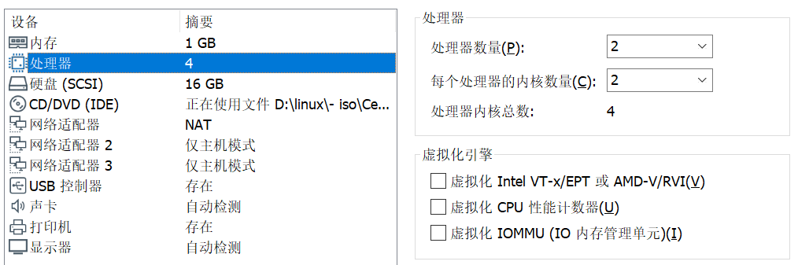

# DPDK overview

> **date**: 2021.04.07
>
> **auther**: BlcDing
>
> **tag**: `DPDK`

## 1.Introduction

**DPDK（Data Plane Development Kit）是数据平面开发套件，它由多个库组成，可加快运行在各种CPU架构上的数据包处理工作量。**

DPDK的主要目标是为数据平面应用程序中的快速数据包处理提供一个简单，完整的框架。用户可以使用该代码来理解所采用的某些技术，在其基础上进行原型设计或添加他们自己的协议栈。提供了使用DPDK的替代生态系统选项。

该框架**通过创建环境抽象层（[EAL](#1.1.Environment Abstraction Layer)）为特定环境创建了一组库**，该库可能特定于英特尔®体系结构（32位或64位），Linux *用户空间编译器或一个特定的平台。这些环境是通过使用介子文件和配置文件创建的。创建EAL库后，用户可以与该库链接以创建自己的应用程序。还提供了EAL之外的其他库，包括哈希，最长前缀匹配（LPM）和ring库。提供了示例应用程序，以帮助向用户展示如何使用DPDK的各种功能。

DPDK为数据包处理实现了运行到完成的模型，该模型必须在调用Data Plane应用程序之前分配所有资源，这些应用程序在逻辑处理核心上作为执行单元运行。该模型不支持调度程序，并且所有设备都可以通过**轮询**来访问。不使用中断的主要原因是中断处理带来的性能开销。

除了运行完成模型之外，还可以通过通过环在内核之间传递数据包或消息来使用流水线模型。这允许分阶段执行工作，并可以更有效地使用内核上的代码。

### 1.1.Environment Abstraction Layer

环境抽象层（EAL）负责访问低级资源，例如硬件和内存空间。它提供了一个通用接口，可从应用程序和库中隐藏环境细节。初始化例程负责决定如何分配这些资源（即内存空间，设备，计时器，控制台等）。

EAL预期的典型服务是：

- DPDK的加载和启动：DPDK及其应用程序链接为单个应用程序，必须通过某种方式进行加载。
- 核心亲和力（[Core Affinity](#ps: Core Affinity)）/分配过程：EAL提供了用于将执行单元分配给特定核心以及创建执行实例的机制。
- 系统内存预留：EAL有助于预留不同的内存区域，例如，用于设备交互的物理内存区域。
- 跟踪和调试功能：日志，dump_stack，紧急情况等。
- 实用程序功能：libc中未提供的自旋锁和原子计数器。
- CPU功能标识：在运行时确定是否支持特定功能，例如，英特尔®AVX。确定当前CPU是否支持编译二进制文件的功能集。
- 中断处理：用于注册/注销特定中断源的回调的接口。
- 警报功能：用于设置/删除在特定时间运行的回调的接口。

### 1.2.以太网* 轮询模式驱动程序体系结构

DPDK包括用于1GbE，10GbE和40GbE的轮询模式驱动程序（PMD），以及半虚拟化的virtio以太网控制器，这些控制器无需异步，基于中断的信令机制工作。

### 1.3.数据包转发算法支持

DPDK包括哈希（librte_hash）和最长前缀匹配（LPM，librte_lpm）库，以支持相应的数据包转发算法。

### 1.4.librte_net

librte_net库是IP协议定义和便捷宏的集合。 它基于FreeBSD * IP堆栈中的代码，并包含协议编号（用于IP标头），与IP相关的宏，IPv4 / IPv6标头结构以及TCP，UDP和SCTP标头结构。

### ps: Core Affinity

CPU 亲和性（affinity）就是进程要在某个给定的 CPU 上尽量长时间地运行而不被迁移到其他处理器的倾向性。

**软亲和性（affinity）:** 就是进程要在指定的 CPU 上尽量长时间地运行而不被迁移到其他处理器，Linux 内核进程调度器天生就具有被称为 软 CPU 亲和性（affinity） 的特性，这意味着进程通常不会在处理器之间频繁迁移。这种状态正是我们希望的，因为进程迁移的频率小就意味着产生的负载小。

**硬亲和性（affinity）：**简单来说就是利用linux内核提供给用户的API，强行将进程或者线程绑定到某一个指定的cpu核运行。

## 2.Core Components

核心组件是一组库，这些库提供了高性能数据包处理应用程序所需的所有元素。


### 2.1.环管理器（librte_ring）

环形结构在有限大小的表中提供了无锁的多生产者、多消费者的FIFO（First Input First Output 先进先出） API。与无锁队列相比，它具有一些优势。易于实施，适合批量操作且速度更快。环由内存池管理器（librte_mempool）使用，并且可以用作内核和/或在逻辑内核上连接在一起的执行块之间的常规通信机制。

### 2.2.内存池管理器（librte_mempool）

内存池管理器负责在内存中分配对象池。池按名称标识，并使用环存储空闲对象。它提供了一些其他可选服务，例如每核对象缓存和对齐帮助器，以确保填充对象以将它们平均分配到所有RAM通道上。

### 2.3.网络数据包缓冲区管理（librte_mbuf）

mbuf库提供了创建和销毁缓冲区的功能，DPDK应用程序可以使用该缓冲区来存储消息缓冲区。消息缓冲区是在启动时创建的，并使用DPDK内存池库存储在内存池中。

该库提供了一个API，用于分配/释放mbuf，操纵用于承载网络数据包的数据包缓冲区。

### 2.4.计时器管理器（librte_timer）

该库为DPDK执行单元提供计时器服务，从而能够异步执行功能。它可以是定期的函数调用，也可以是单次调用。它使用环境抽象层（EAL）提供的计时器接口来获取精确的时间参考，并且可以根据需要在每个内核上启动。

## 3.Environment

### 3.1.配置环境

虚拟机配置如下



系统环境

```
[root@localhost ~]# cat /etc/redhat-release
CentOS Linux release 7.3.1611 (Core)
[root@localhost ~]# cat /proc/version
Linux version 3.10.0-514.el7.x86_64 (builder@kbuilder.dev.centos.org) (gcc version 4.8.5 20150623 (Red Hat 4.8.5-11) (GCC) ) #1 SMP Tue Nov 22 16:42:41 UTC 2016
[root@localhost ~]# ldd --version
ldd (GNU libc) 2.17
```

DPDK版本

```
http://fast.dpdk.org/rel/dpdk-16.11.11.tar.xz
```

### 3.2.内核开发环境配置

> 写在前面：
>
> 特别要注意 `kernel` `kernel-devel` `kernel-headers` 版本问题，使用 `yum install` 可能会造成版本不一致，在后续安装过程中造成无数玄学问题（血泪教训）

```shell
[root@localhost ~]# uname -r
3.10.0-514.el7.x86_64
```

google了相同版本的 `kernel-devel` `kernel-headers` 

```
rpm -ivh kernel-headers-3.10.0-514.el7.x86_64.rpm
rpm -ivh kernel-devel-3.10.0-514.el7.x86_64.rpm
```

执行第二条命令时，报错

```
error: Failed dependencies:
	perl is needed by kernel-devel-3.10.0-514.el7.x86_64
```

解决方案

```
yum install perl
rpm -ivh kernel-devel-3.10.0-514.el7.x86_64.rpm
```

最后看一下版本是否一致

```
[root@localhost home]# uname -a ; rpm -qa kernel\* | sort
Linux localhost.localdomain 3.10.0-514.el7.x86_64 #1 SMP Tue Nov 22 16:42:41 UTC 2016 x86_64 x86_64 x86_64 GNU/Linux
kernel-3.10.0-514.el7.x86_64
kernel-devel-3.10.0-514.el7.x86_64
kernel-headers-3.10.0-514.el7.x86_64
kernel-tools-3.10.0-514.el7.x86_64
kernel-tools-libs-3.10.0-514.el7.x86_64
```

### 3.3.安装gcc gcc-c++

> 注意安装顺序，因为 `gcc` 依赖 `kernel-headers`

```
yum intsall gcc gcc-c++
```

### 3.4.安装DPDK

```
tar -xf dpdk-16.11.11.tar.xz
```

> DPDK 16版本有bug，要进行如下修改

修改 `/lib/librte_eal/linuxapp/igb_uio/igb_uio.c`

```c
		/* fall back to INTX */
	case RTE_INTR_MODE_LEGACY:
		if (pci_intx_mask_supported(dev)) {
			dev_dbg(&dev->dev, "using INTX");
			udev->info.irq_flags = IRQF_SHARED;
			udev->info.irq = dev->irq;
			udev->mode = RTE_INTR_MODE_LEGACY;
			break;
		}
		dev_notice(&dev->dev, "PCI INTX mask not supported\n");
```

在如下位置添加 ` || true`

```c
		/* fall back to INTX */
	case RTE_INTR_MODE_LEGACY:
		if (pci_intx_mask_supported(dev) || true) {
			dev_dbg(&dev->dev, "using INTX");
			udev->info.irq_flags = IRQF_SHARED;
			udev->info.irq = dev->irq;
			udev->mode = RTE_INTR_MODE_LEGACY;
			break;
		}
		dev_notice(&dev->dev, "PCI INTX mask not supported\n");
```

执行安装脚本


```
cd /home/dpdk-stable-16.11.11/tools
./dpdk-setup.sh
```

提示如下

```
------------------------------------------------------------------------------
 RTE_SDK exported as /home/dpdk-stable-16.11.11
------------------------------------------------------------------------------
----------------------------------------------------------
 Step 1: Select the DPDK environment to build
----------------------------------------------------------
[1] arm64-armv8a-linuxapp-gcc
[2] arm64-dpaa2-linuxapp-gcc
[3] arm64-thunderx-linuxapp-gcc
[4] arm64-xgene1-linuxapp-gcc
[5] arm-armv7a-linuxapp-gcc
[6] i686-native-linuxapp-gcc
[7] i686-native-linuxapp-icc
[8] ppc_64-power8-linuxapp-gcc
[9] tile-tilegx-linuxapp-gcc
[10] x86_64-native-bsdapp-clang
[11] x86_64-native-bsdapp-gcc
[12] x86_64-native-linuxapp-clang
[13] x86_64-native-linuxapp-gcc
[14] x86_64-native-linuxapp-icc
[15] x86_x32-native-linuxapp-gcc

----------------------------------------------------------
 Step 2: Setup linuxapp environment
----------------------------------------------------------
[16] Insert IGB UIO module
[17] Insert VFIO module
[18] Insert KNI module
[19] Setup hugepage mappings for non-NUMA systems
[20] Setup hugepage mappings for NUMA systems
[21] Display current Ethernet/Crypto device settings
[22] Bind Ethernet/Crypto device to IGB UIO module
[23] Bind Ethernet/Crypto device to VFIO module
[24] Setup VFIO permissions

----------------------------------------------------------
 Step 3: Run test application for linuxapp environment
----------------------------------------------------------
[25] Run test application ($RTE_TARGET/app/test)
[26] Run testpmd application in interactive mode ($RTE_TARGET/app/testpmd)

----------------------------------------------------------
 Step 4: Other tools
----------------------------------------------------------
[27] List hugepage info from /proc/meminfo

----------------------------------------------------------
 Step 5: Uninstall and system cleanup
----------------------------------------------------------
[28] Unbind devices from IGB UIO or VFIO driver
[29] Remove IGB UIO module
[30] Remove VFIO module
[31] Remove KNI module
[32] Remove hugepage mappings

[33] Exit Script
```

#### 3.4.1.配置编译的环境

```
Option:13 //x86_64-native-linuxapp-gcc
```

#### 3.4.2.加载igb uio模块

```
Option:16 //Insert IGB UIO module
```

#### 3.4.3.配置大页

```
Option: 19 //Setup hugepage mappings for non-NUMA systems

Removing currently reserved hugepages
Unmounting /mnt/huge and removing directory

  Input the number of 2048kB hugepages
  Example: to have 128MB of hugepages available in a 2MB huge page system,
  enter '64' to reserve 64 * 2MB pages
Number of pages: 128
Reserving hugepages
Creating /mnt/huge and mounting as hugetlbfs
```

#### 3.4.4.列出大页

```
Option: 27 //List hugepage info from /proc/meminfo

AnonHugePages:      4096 kB
HugePages_Total:      63
HugePages_Free:       63
HugePages_Rsvd:        0
HugePages_Surp:        0
Hugepagesize:       2048 kB
```

#### 3.4.5.显示网卡状态

```
Option: 21 //Display current Ethernet/Crypto device settings


Network devices using DPDK-compatible driver
============================================
<none>

Network devices using kernel driver
===================================
0000:02:01.0 '82545EM Gigabit Ethernet Controller (Copper)' if=ens33 drv=e1000 unused=igb_uio *Active*
0000:02:05.0 '82545EM Gigabit Ethernet Controller (Copper)' if=ens37 drv=e1000 unused=igb_uio *Active*
0000:02:06.0 '82545EM Gigabit Ethernet Controller (Copper)' if=ens38 drv=e1000 unused=igb_uio *Active*

Other network devices
=====================
<none>

Crypto devices using DPDK-compatible driver
===========================================
<none>

Crypto devices using kernel driver
==================================
<none>

Other crypto devices
====================
<none>
```

#### 3.4.6.绑定网卡

```
Option: 22 //Bind Ethernet/Crypto device to IGB UIO module


Network devices using DPDK-compatible driver
============================================
<none>

Network devices using kernel driver
===================================
0000:02:01.0 '82545EM Gigabit Ethernet Controller (Copper)' if=ens33 drv=e1000 unused=igb_uio *Active*
0000:02:05.0 '82545EM Gigabit Ethernet Controller (Copper)' if=ens37 drv=e1000 unused=igb_uio *Active*
0000:02:06.0 '82545EM Gigabit Ethernet Controller (Copper)' if=ens38 drv=e1000 unused=igb_uio *Active*

Other network devices
=====================
<none>

Crypto devices using DPDK-compatible driver
===========================================
<none>

Crypto devices using kernel driver
==================================
<none>

Other crypto devices
====================
<none>

Enter PCI address of device to bind to IGB UIO driver: 02:05.0
Routing table indicates that interface 0000:02:05.0 is active. Not modifying
```

因为绑定的网卡处于活动状态，执行如下命令，再重新绑定

```
ifconfig ens38 down
```

重新绑定网卡

```
Option: 22


Network devices using DPDK-compatible driver
============================================
<none>

Network devices using kernel driver
===================================
0000:02:01.0 '82545EM Gigabit Ethernet Controller (Copper)' if=ens33 drv=e1000 unused=igb_uio *Active*
0000:02:05.0 '82545EM Gigabit Ethernet Controller (Copper)' if=ens37 drv=e1000 unused=igb_uio *Active*
0000:02:06.0 '82545EM Gigabit Ethernet Controller (Copper)' if=ens38 drv=e1000 unused=igb_uio 

Other network devices
=====================
<none>

Crypto devices using DPDK-compatible driver
===========================================
<none>

Crypto devices using kernel driver
==================================
<none>

Other crypto devices
====================
<none>

Enter PCI address of device to bind to IGB UIO driver: 02:06.0
OK
```

#### 3.4.7.helloworld

```
cd /home/dpdk-stable-16.11.11/examples/helloworld
```

编译执行

```
make RTE_SDK=/home/dpdk-stable-16.11.11 RTE_TARGET=x86_64-native-linuxapp-gcc
./build/helloworld
```

结果如下

```
EAL: Detected 4 lcore(s)
EAL: No free hugepages reported in hugepages-1048576kB
EAL: Probing VFIO support...
EAL: PCI device 0000:02:01.0 on NUMA socket -1
EAL:   probe driver: 8086:100f net_e1000_em
EAL: PCI device 0000:02:05.0 on NUMA socket -1
EAL:   probe driver: 8086:100f net_e1000_em
EAL: PCI device 0000:02:06.0 on NUMA socket -1
EAL:   probe driver: 8086:100f net_e1000_em
hello from core 1
hello from core 2
hello from core 3
hello from core 0
```

芜湖起飞QwQ