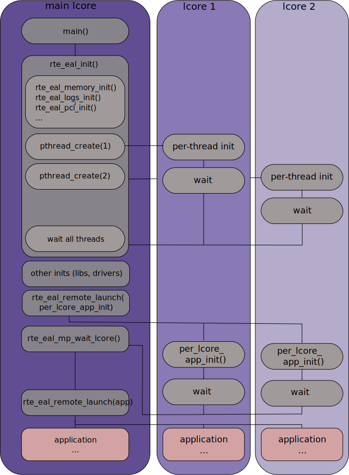

# DPDK helloworld

> **date**: 2021.08.13
>
> **auther**: BlcDing
>
> **tag**: `DPDK`

### 1.Introduction

根据DPDK的examples中的helloworld项目，学习`rte_eal_init`函数流程

环境抽象层（EAL）负责访问低级资源，例如硬件和内存空间。它提供了一个通用接口，可从应用程序和库中隐藏环境细节。初始化例程负责决定如何分配这些资源（即内存空间，设备，计时器，控制台等）

### 2.helloworld项目流程


### 3.lcore启动过程和任务分发

通过helloworld项目的流程，能更好的理解下图



### 4.lcore

在操作系统中，最容易造成性能下降的是线程的调度，尤其是核间线程的切换，最容易造成cache miss和cache write back

所以在DPDK中利用的是线程的CPU亲和绑定的方式，来指定任务到不同的核上

再进一步，可以限制一些核不参与Linux的系统调度，这样就可以达到任务独占的目的，最大限度地避免了cache不命中带来的性能下降

DPDK中的多线程是基于linux系统里的pthread实现的，lcore指的是EAL线程，并且在命令行参数中使用 `-c` 带十六进制参数作为coremask，该掩码的意义是为二进制数上为1的一位即表示将要绑定独占的线程

例如：掩码是16进制的f，二进制对应为1111，即表示cpu0、cpu1、cpu2、cpu3作为逻辑核为程序所用

#### 4.1.master core 和 slave core 的关系

`eal_parse_args()` 函数，解析 `-c` 参数，确认哪些核是可以用的，并且设置第一个核为MASTER

#### 4.2.core state

```c
enum rte_lcore_state_t {
	WAIT,       /**< waiting a new command */
	RUNNING,    /**< executing command */
	FINISHED,   /**< command executed */
};
```

以helloworld项目为例，分别在以下位置对lcore的状态进行设置

**WAIT**

```c
int
rte_eal_init(int argc, char **argv)
{
	...

	RTE_LCORE_FOREACH_SLAVE(i) {

		...

		lcore_config[i].state = WAIT;

		/* create a thread for each lcore */
		ret = pthread_create(&lcore_config[i].thread_id, NULL,
				     eal_thread_loop, NULL);
		...
	}
	...
}
```

**RUNNING** & **FINISHED**

```c
/* main loop of threads */
__attribute__((noreturn)) void *
eal_thread_loop(__attribute__((unused)) void *arg)
{
    ...

	/* read on our pipe to get commands */
	while (1) {
		
        ...

		lcore_config[lcore_id].state = RUNNING;

		...
            
		fct_arg = lcore_config[lcore_id].arg;
		ret = lcore_config[lcore_id].f(fct_arg);
		lcore_config[lcore_id].ret = ret;
		rte_wmb();
		lcore_config[lcore_id].state = FINISHED;
	}
	...
}
```

### 5.pipe

`lcore_config` 中的 `pipe_master2slave[2]` 和 `pipe_slave2master[2]` 分别是主线程到从线程核从线程到主线程的管道，与linux中的管道一样，是一个大小为2的数组，数组的第一个元素为读打开，第二个元素为写打开。

这里调用了linux库函数read和write，把c作为消息传递。管道的模型如下图所示：


### 6.helloworld中出现的c语言语法

#### 6.1.\__attribute__((unused))

```c
static int
lcore_hello(__attribute__((unused)) void *arg)
{
	unsigned lcore_id;
	lcore_id = rte_lcore_id();
	printf("hello from core %u\n", lcore_id);
	return 0;
}
```

表示该函数或变量可能不使用，这个属性可以避免编译器产生警告信息

```
warning: 'lcore_hello' defined but not used
```

#### 6.2.函数指针

```c
static int lcore_hello(__attribute__((unused)) void *arg){}

int rte_eal_remote_launch(int (*f)(void *), void *arg, unsigned slave_id){}

int main(int argc, char **argv)
{
	rte_eal_remote_launch(lcore_hello, NULL, lcore_id);
}
```

`rte_eal_remote_launch(lcore_hello, NULL, lcore_id);`可以理解为

```c 
static int lcore_hello(__attribute__((unused)) void *arg){} //定义函数
int (*f)(void *); //定义一个函数指针
f = lcore_hello //把函数lcore_hello赋给指针变量f, 使f指向lcore_hello函数
```

