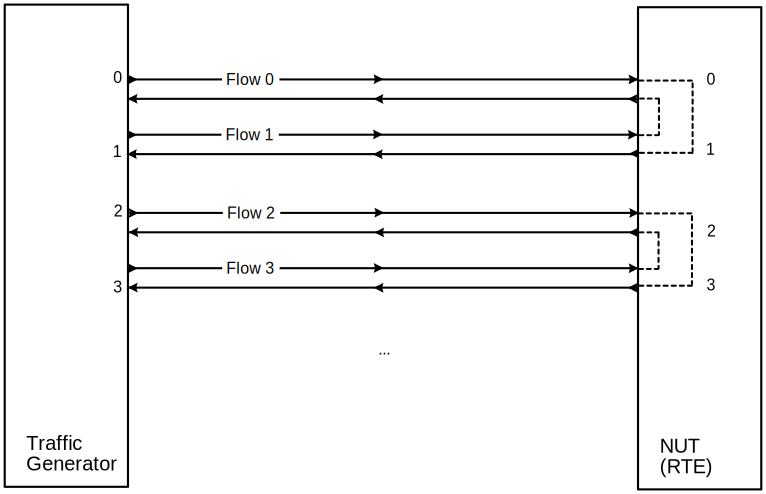
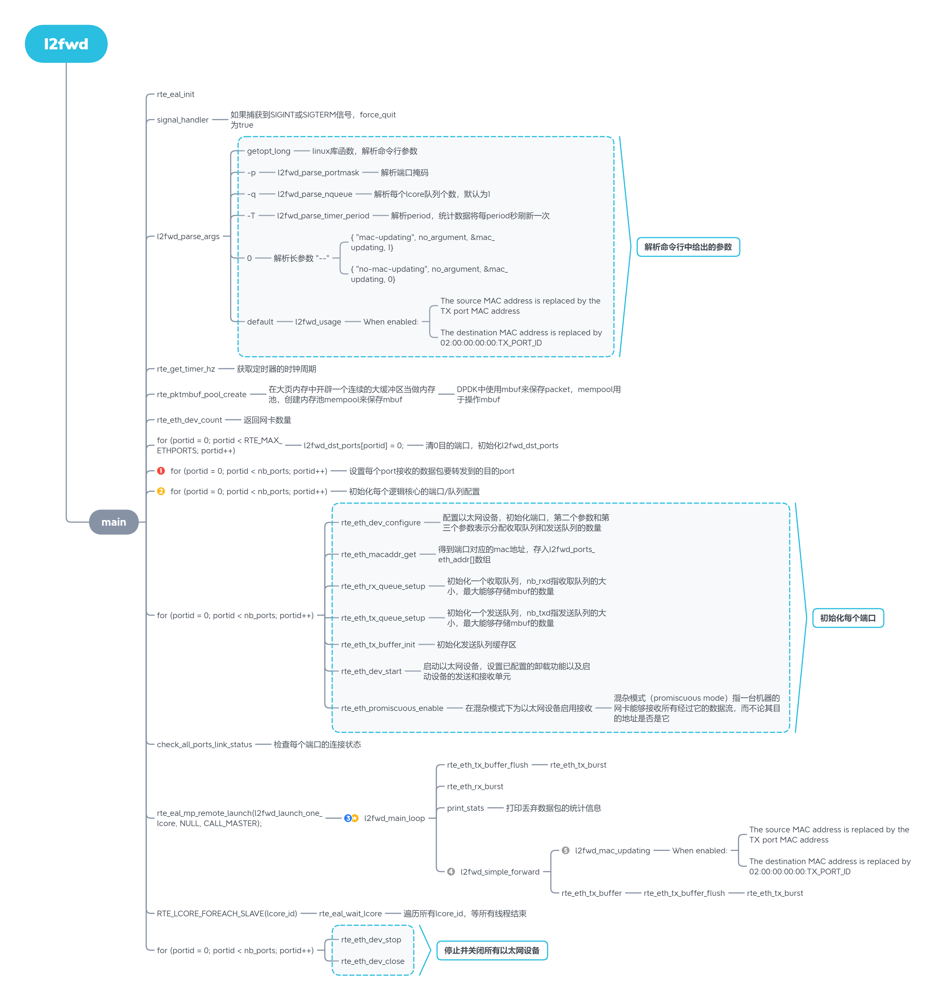
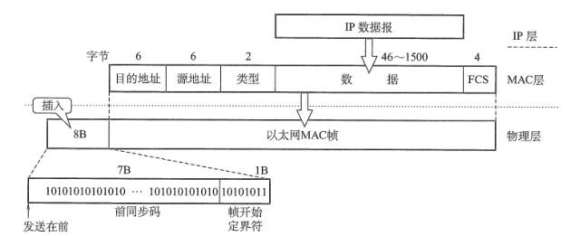

# DPDK l2fwd

> **date**: 2021.10.17
>
> **auther**: BlcDing
>
> **tag**: `DPDK`

### 1.Introduction

l2fwd可以在真实环境和虚拟化环境中运行，为port上接收到的每个数据包执行二层转发。

目的端口是启用的端口掩码中的相邻端口，即如果前四个端口启用（端口掩码 0xf），则端口0和1相互转发，端口2和3相互转发。



### 2.l2fwd项目流程



#### 2.1.端口处理

可用端口位掩码`l2fwd_enabled_port_mask`表示，左数第n位如果为1，表示端口n可用，如果左数第n位如果为0，表示端口n不可用

要得到第x位为1还是0，我们的方法是将1左移x位，得到一个只在x位为1，其他位都为0的数，再与位掩码相与，结果为1，那么第x位为1，结果为0，那么第x位为0

```c
	unsigned nb_ports_in_mask = 0;
	...
	last_port = 0;
	...
	for (portid = 0; portid < nb_ports; portid++) {
		/* skip ports that are not enabled */
        // 跳过未启用的端口
		if ((l2fwd_enabled_port_mask & (1 << portid)) == 0)
			continue;
		// 这里设置数据包进入端口后，转发给相邻的端口
		// 每两个端口为一对，相互转发
        // 0->1 1->0 2->3 3->2 ...
		if (nb_ports_in_mask % 2) {
			l2fwd_dst_ports[portid] = last_port;
			l2fwd_dst_ports[last_port] = portid;
		}
		else
			last_port = portid; // 对last_port赋值

		nb_ports_in_mask++; // 对标记+1
		// 检索以太网设备的上下文信息
		rte_eth_dev_info_get(portid, &dev_info);
	}
	// 如果剩下一个网口，则该网口自己转发给自己
	if (nb_ports_in_mask % 2) {
		printf("Notice: odd number of ports in portmask.\n");
		l2fwd_dst_ports[last_port] = last_port;
	}
```

#### 2.2.初始化每个逻辑核心的端口/队列配置

为每个端口分配到相应的逻辑内核和一个专用的TX队列

每个端口只对应一个逻辑内核

每个逻辑内核对应`l2fwd_rx_queue_per_lcore`个端口

```c
	struct lcore_queue_conf lcore_queue_conf[RTE_MAX_LCORE]; // 全局
	...
	struct lcore_queue_conf *qconf;
	...
	qconf = NULL;

	/* Initialize the port/queue configuration of each logical core */
	for (portid = 0; portid < nb_ports; portid++) {
		/* skip ports that are not enabled */
		if ((l2fwd_enabled_port_mask & (1 << portid)) == 0)
			continue;

		/* get the lcore_id for this port */
		while (rte_lcore_is_enabled(rx_lcore_id) == 0 ||
		       lcore_queue_conf[rx_lcore_id].n_rx_port ==
		       l2fwd_rx_queue_per_lcore) {
			rx_lcore_id++;
			if (rx_lcore_id >= RTE_MAX_LCORE)
				rte_exit(EXIT_FAILURE, "Not enough cores\n");
		}
		// 赋值qconf
		if (qconf != &lcore_queue_conf[rx_lcore_id])
			/* Assigned a new logical core in the loop above. */
			qconf = &lcore_queue_conf[rx_lcore_id];
		
        // 当前lcore添加一个port
		qconf->rx_port_list[qconf->n_rx_port] = portid;
        // 当前lcore管理的rx_port总数+1
		qconf->n_rx_port++;
		printf("Lcore %u: RX port %u\n", rx_lcore_id, (unsigned) portid);
	}
```

#### 2.3.主处理循环

```c
#define MAX_RX_QUEUE_PER_LCORE 16
struct lcore_queue_conf {
	unsigned n_rx_port; // rx_port个数
	unsigned rx_port_list[MAX_RX_QUEUE_PER_LCORE]; // rx_port列表
} __rte_cache_aligned;
// 一个计算机，包含多个核心，一个核心处理多个rx_port
struct lcore_queue_conf lcore_queue_conf[RTE_MAX_LCORE];

/* main processing loop */
static void
l2fwd_main_loop(void)
{
	struct rte_mbuf *pkts_burst[MAX_PKT_BURST];
	struct rte_mbuf *m;
	int sent;
	unsigned lcore_id;
	uint64_t prev_tsc, diff_tsc, cur_tsc, timer_tsc;
	unsigned i, j, portid, nb_rx;
	struct lcore_queue_conf *qconf;
	const uint64_t drain_tsc = (rte_get_tsc_hz() + US_PER_S - 1) / US_PER_S *
			BURST_TX_DRAIN_US;
	struct rte_eth_dev_tx_buffer *buffer;

	prev_tsc = 0;
	timer_tsc = 0;
	// 获取当前运行的lcore_id
	lcore_id = rte_lcore_id();
    // 获取当前lcore队列配置的信息
	qconf = &lcore_queue_conf[lcore_id];

    // 如果当前lcore配置端口个数为0，返回
	if (qconf->n_rx_port == 0) {
		RTE_LOG(INFO, L2FWD, "lcore %u has nothing to do\n", lcore_id);
		return;
	}

	RTE_LOG(INFO, L2FWD, "entering main loop on lcore %u\n", lcore_id);

    // 向log记录，当前lcore配置的每个端口信息
	for (i = 0; i < qconf->n_rx_port; i++) {
		portid = qconf->rx_port_list[i];
		RTE_LOG(INFO, L2FWD, " -- lcoreid=%u portid=%u\n", lcore_id,
			portid);
	}

	while (!force_quit) {
		// 获取当前时间戳
		cur_tsc = rte_rdtsc();

		/*
		 * TX burst queue drain
		 */
        // TX队列置空
        // 对比时间戳
		diff_tsc = cur_tsc - prev_tsc;
		if (unlikely(diff_tsc > drain_tsc)) {

			for (i = 0; i < qconf->n_rx_port; i++) {
				// 获取portid和buffer
				portid = l2fwd_dst_ports[qconf->rx_port_list[i]];
				buffer = tx_buffer[portid];
				// 把buffer中的数据发送到portid对应的port
				sent = rte_eth_tx_buffer_flush(portid, 0, buffer);
				if (sent)
                    // 如果发包成功，发包计数 += s
					port_statistics[portid].tx += sent;

			}

			/* if timer is enabled */
            // 如果计时器开启
			if (timer_period > 0) {

				/* advance the timer */
                // 调整计时器
				timer_tsc += diff_tsc;

				/* if timer has reached its timeout */
                // 如果累积时间超过我们设定的阈值，就打印出统计数据，默认是10s
				if (unlikely(timer_tsc >= timer_period)) {

					/* do this only on master core */
                    // 主线程打印一些属性，仅有主线程会执行print_stats
					if (lcore_id == rte_get_master_lcore()) {
						print_stats();
						/* reset the timer */
                        // 累积时间置零
						timer_tsc = 0;
					}
				}
			}

			prev_tsc = cur_tsc;
		}

		/*
		 * Read packet from RX queues
		 */
        // 从RX队列中收包
		for (i = 0; i < qconf->n_rx_port; i++) {

			portid = qconf->rx_port_list[i];
            // 从portid对应的port收到nb_rx个包，一次最多收取MAX_PKT_BURST个数据包
            // 这nb_rx个包，存入pkts_burst结构体
			nb_rx = rte_eth_rx_burst((uint8_t) portid, 0,
						 pkts_burst, MAX_PKT_BURST);
			// 更新统计数据，收包计数 += nb_rx
			port_statistics[portid].rx += nb_rx;
			// 遍历收到的包
			for (j = 0; j < nb_rx; j++) {
				m = pkts_burst[j];
                // 预取指令prefetch0
                // 这条指令主要的作用是人为判断下面将要处理的内存，指示CPU加载到缓存中
				rte_prefetch0(rte_pktmbuf_mtod(m, void *));
                // 调用转发函数，处理收到的包
				l2fwd_simple_forward(m, portid);
			}
		}
	}
}
```

#### 2.4.转发函数

```c
static void
l2fwd_simple_forward(struct rte_mbuf *m, unsigned portid)
{
	unsigned dst_port;
	int sent;
	struct rte_eth_dev_tx_buffer *buffer;
	// 获取目的端口
	dst_port = l2fwd_dst_ports[portid];
	// 更新mac地址
	if (mac_updating)
		l2fwd_mac_updating(m, dst_port);
    // 获得初始化的时候配置的发送缓存
	buffer = tx_buffer[dst_port];
    // 把m中的数据保存到buffer
    // 把buffer中的数据发送到dst_port对应的port
	sent = rte_eth_tx_buffer(dst_port, 0, buffer, m);
	if (sent)
        // 如果发包成功，发包计数 += sent
		port_statistics[dst_port].tx += sent;
}
```

#### 2.5.更新mac地址

mac帧格式如图



```c
static void
l2fwd_mac_updating(struct rte_mbuf *m, unsigned dest_portid)
{
	struct ether_hdr *eth;
	void *tmp;
	// 通过偏移，eth指向缓存池中二层帧头，并存储帧头信息
	eth = rte_pktmbuf_mtod(m, struct ether_hdr *);

	/* 02:00:00:00:00:xx */
    // tmp指向二层帧中目的地址的首个字节，小端字节序，实际上是mac地址中最后两位
	tmp = &eth->d_addr.addr_bytes[0];
	*((uint64_t *)tmp) = 0x000000000002 + ((uint64_t)dest_portid << 40);

	/* src addr */
    // 源地址变成转发端口的mac地址
	ether_addr_copy(&l2fwd_ports_eth_addr[dest_portid], &eth->s_addr);
}
```

### 3.l2fwd中出现的C语言特殊语法

#### unlikely

```c
if (unlikely(diff_tsc > drain_tsc))
```

首先

    if(likely(value)) 等价于 if(value)
    if(unlikely(value)) 等价于 if(value)

这两个宏在内核中定义如下：

```c
#define likely(x)       __builtin_expect((x),1)
#define unlikely(x)     __builtin_expect((x),0)
```

`__builtin_expect()` 是 GCC (version >= 2.96）提供给程序员使用的，目的是将“分支转移”的信息提供给编译器，这样编译器可以对代码进行优化， 以减少指令跳转带来的性能下降。

```
__builtin_expect((x),1) 表示 x 的值为真的可能性更大
__builtin_expect((x),0) 表示 x 的值为假的可能性更大
```

