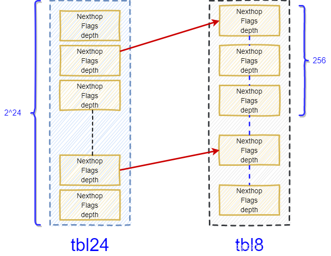

# DPDK l3fwd

> **date**: 2021.10.31
>
> **auther**: BlcDing
>
> **tag**: `DPDK`

## 1.Introduction

l3fwd应用程序演示了如何使用dpdk中的hash和lpm库来实现数据包转发，初始化和运行时路径与l2fwd（在真实和虚拟化环境中）的路径非常相似，与 l2fwd的主要区别在于，转发决策是根据从输入数据包中读取的信息做出的

查找方法基于hash或基于lpm，并在运行时选择

- 当所选查找方法基于hash时，hash对象用于模拟流分类阶段。散列对象与流表相关联使用，以在运行时将每个输入数据包映射到其流。
  - hash查找键由一个5元组表示，由从输入数据包中读取的以下字段组成：源ip地址、目的ip地址、四层协议、源端口和目的端口
  - 从标识的流表条目中读取输入数据包的输出接口的id
  - 应用程序使用的一组流是静态配置的，并在初始化时加载到hash中

- 当所选查找方法是基于lpm时，lpm对象用于模拟ipv4数据包的转发阶段。
  - lpm对象用作路由表，以在运行时识别每个输入数据包的下一跳
  - lpm查找键由从输入数据包中读取的目标ip地址字段表示
  - 输入数据包的输出接口id是lpm查找返回的下一跳
  - 应用程序使用的lpm规则集是静态配置的，并在初始化时加载到lpm对象中

在l3fwd中，基于哈希的转发支持ipv4和ipv6，基于lpm的转发仅支持ipv4

## 2.l3fwd项目流程


## 3.l3fwd中出现的C语言库函数

### strtoul

```c
unsigned long int strtoul(const char *nptr, char **endptr, int base);
```

C 库函数`strtoul`把参数`str`所指向的字符串根据给定的`base`转换为一个无符号长整数（类型为`unsigned long int`型）

`base`必须介于2和 36（包含）之间，或者是特殊值0。（进制转换）

当`base`的值为0时，默认采用10进制转换，但如果遇到`0x`/`0X`前置字符则会使用 16 进制转换，遇到`0`前置字符则会使用 8 进制转换。

```c
static int
parse_portmask(const char *portmask)
{
	char *end = NULL;
	unsigned long pm;

	/* parse hexadecimal string */
	pm = strtoul(portmask, &end, 16);
	if ((portmask[0] == '\0') || (end == NULL) || (*end != '\0'))
		return -1;

	if (pm == 0)
		return -1;

	return pm;
}
```

### snprintf

```c
int snprintf ( char * str, size_t size, const char * format, ... );
```

C库函数`snprintf`设将可变参数(`...`)按照`format`格式化成字符串，并将字符串复制到`str`中，`size`为要写入的字符的最大数目，超过`size`会被截断

```c
snprintf(s, sizeof(s), "ipv4_l3fwd_hash_%d", socketid);
```

## 4.l3fwd_lpm_lkp

```c
static struct l3fwd_lkp_mode l3fwd_lpm_lkp = {
	.setup                  = setup_lpm,
	.check_ptype		= lpm_check_ptype,
	.cb_parse_ptype		= lpm_cb_parse_ptype,
	.main_loop              = lpm_main_loop,
	.get_ipv4_lookup_struct = lpm_get_ipv4_l3fwd_lookup_struct,
	.get_ipv6_lookup_struct = lpm_get_ipv6_l3fwd_lookup_struct,
};
```

**最长前缀匹配（Longest Prefix Match，LPM）**是指在IP协议中，被路由器用于在路由表中进行选择的一个算法，当路由表中有多条条目可以匹配目的ip时，一般就采用掩码最长的一条作为匹配项并确定下一跳。

> 例如，考虑如下ipv4路由表：
>
> ```
> 192.168.20.16/28 e0
> 192.168.0.0/16 s0
> ```
>
> 在要查找地址`192.168.20.19`的时候，这两个表项都“匹配”，即这两条表项都包含要查找的目的地址。这种情况下，前缀最长的路由就是192.168.20.16/28，因为它的子网掩码（/28）比其他表项的掩码（/16）要长，使得它更加明确。根据最长匹配原则，第一个表项有28位匹配，大于第二项（16位匹配），因此，数据包通过e0发送出去。

DPDK实现的lpm算法，针对路由表查询设计了数据结构`rte_lpm`

这种数据结构将IP地址空间分为二级表的方式进行查询

- 前缀的24位共有2^24个条目，即IP地址的前三个字节对应的数值在表中存在一一对应项
- 低8位的256个条目可以根据需求进行分配（节省空间）

在实际使用中，查找的ip掩码长度绝大多数是<=24位的，因此这部分通过一次内存访问便可以找到对应的路由

当查找的IP掩码长度超过24时，需要两次访问内存，而这种情况相对较少

因此DPDK实现的lpm算法兼顾了时间和空间效率

## 5.l3fwd_em_lkp

```c
static struct l3fwd_lkp_mode l3fwd_em_lkp = {
	.setup                  = setup_hash,
	.check_ptype		= em_check_ptype,
	.cb_parse_ptype		= em_cb_parse_ptype,
	.main_loop              = em_main_loop,
	.get_ipv4_lookup_struct = em_get_ipv4_l3fwd_lookup_struct,
	.get_ipv6_lookup_struct = em_get_ipv6_l3fwd_lookup_struct,
};
```

`cuckoo hash`：哈希函数是成对的，每一个元素都有两个，分别映射到两个位置，一个是记录的位置，另一个是备用位置

这个备用位置是处理碰撞时用的

`cuckoo hash`处理碰撞的方法，就是把原来占用位置的这个元素踢走，被踢出去的元素有一个备用位置可以安置，如果备用位置上还有元素，再把它踢走，如此往复

直到被踢的次数达到一个上限，才确认哈希表已满

## 6.struct

### 6.1.lpm路由表相关结构

#### rte_lpm_config

```c
/** LPM configuration structure. */
struct rte_lpm_config {
    // 存储的最大路由条目个数
    // 用来分配rte_lpm结构中rules_tbl的存储空间
	uint32_t max_rules;      /**< Max number of rules. */
    // 存储的最大的tbl8表个数, 每一个tbl8是255个元素(即2^8)
    // 用来分配rte_lpm结构中tbl8的存储空间
	uint32_t number_tbl8s;   /**< Number of tbl8s to allocate. */
	int flags;               /**< This field is currently unused. */
};
```

#### rte_lpm6_config

```c
/** LPM configuration structure. */
struct rte_lpm6_config {
	uint32_t max_rules;      /**< Max number of rules. */
	uint32_t number_tbl8s;   /**< Number of tbl8s to allocate. */
	int flags;               /**< This field is currently unused. */
};
```

#### rte_lpm



```c
struct rte_lpm {
	/* LPM metadata. */ // 路由表元数据
    // 系统可能存在多张路由表（特别是vpn存在的情况下）, 所以需要用name来区分不同的路由表
	char name[RTE_LPM_NAMESIZE];        /**< Name of the lpm. */
    // 存储的最大路由条目个数, 在创建路由表的时候使用rte_lpm_config指定
	uint32_t max_rules; /**< Max. balanced rules per lpm. */
    // 存储的最大的tbl8表个, 每一个tbl8是255个元素(即2^8)，在创建路由表的时候使用rte_lpm_config指定
	uint32_t number_tbl8s; /**< Number of tbl8s. */
    // 存储路由描述信息的结构，RTE_LPM_MAX_DEPTH=32
	struct rte_lpm_rule_info rule_info[RTE_LPM_MAX_DEPTH]; /**< Rule info table. */

	/* LPM Tables. */ //路由表
    // hash24的节点，RTE_LPM_TBL24_NUM_ENTRIES=1 << 24=2^24（使用左移速度快）
	struct rte_lpm_tbl_entry tbl24[RTE_LPM_TBL24_NUM_ENTRIES]
			__rte_cache_aligned; /**< LPM tbl24 table. */
    // hash8的节点，tbl8空间=255*number_tbl8s
	struct rte_lpm_tbl_entry *tbl8; /**< LPM tbl8 table. */
    // 存储具体路由条目的空间，其存储路由条目的个数=max_rules
	struct rte_lpm_rule *rules_tbl; /**< LPM rules. */
};
```

#### rte_lpm_rule_info

```c
/** @internal Contains metadata about the rules table. */
// 路由条目描述信息
// 路由条目是按照掩码位数来组织的
// 同样的掩码位数的路由条目[first_rule, first_rule+used_rules-1]结束
// 路由条目的数据存储在路由表rte_lpm中的rules_tbl中
// 对于ipv4的地址掩码, 一个路由表中总共存在32个rte_lpm_rule_info元素
struct rte_lpm_rule_info {
	uint32_t used_rules; /**< Used rules so far. */
	uint32_t first_rule; /**< Indexes the first rule of a given depth. */
};
```

#### rte_lpm_tbl_entry

```c
// 路由hash表项
__extension__
struct rte_lpm_tbl_entry {
    // 此hash节点的掩码位数
	uint32_t depth       :6;
    /**
	 * For tbl24:
	 *  - valid_group == 0: entry stores a next hop 存储下一跳
	 *  - valid_group == 1: entry stores a group_index pointing to a tbl8 next_hop指向tbl8
	 * For tbl8:
	 *  - valid_group indicates whether the current tbl8 is in use or not
	 */
	uint32_t valid_group :1;
    // 表明此节点是否有效
	uint32_t valid       :1;
    /**
	 * Stores Next hop (tbl8 or tbl24 when valid_group is not set) or
	 * a group index pointing to a tbl8 structure (tbl24 only, when
	 * valid_group is set)
	 */
	uint32_t next_hop    :24;
};
```

#### rte_lpm_rule

```c
// 路由条目表项
struct rte_lpm_rule {
    // 存储路由条目
	uint32_t ip; /**< Rule IP address. */
    // 下一跳的ip地址
	uint32_t next_hop; /**< Rule next hop. */
};
```

#### ipv4_l3fwd_lpm_route

```c
struct ipv4_l3fwd_lpm_route {
	uint32_t ip;  // ip地址
	uint8_t  depth;  // 掩码位数
	uint8_t  if_out;  // 下一跳
};
```

### 6.2.em路由表相关结构

#### rte_hash_parameters

```c
/**
 * Parameters used when creating the hash table.
 */
struct rte_hash_parameters {
	const char *name;		/**< Name of the hash. */
	uint32_t entries;		/**< Total hash table entries. */
	uint32_t reserved;		/**< Unused field. Should be set to 0 */
	uint32_t key_len;		/**< Length of hash key. */
	rte_hash_function hash_func;	/**< Primary Hash function used to calculate hash. */
	uint32_t hash_func_init_val;	/**< Init value used by hash_func. */
	int socket_id;			/**< NUMA Socket ID for memory. */
	uint8_t extra_flag;		/**< Indicate if additional parameters are present. */
};
```

#### ipv4_5tuple_host

```c
union ipv4_5tuple_host {
	struct {
		uint8_t  pad0;
		uint8_t  proto;
		uint16_t pad1;
		uint32_t ip_src;
		uint32_t ip_dst;
		uint16_t port_src;
		uint16_t port_dst;
	};
	xmm_t xmm;
};
```

#### ipv6_5tuple_host

```c
union ipv6_5tuple_host {
	struct {
		uint16_t pad0;
		uint8_t  proto;
		uint8_t  pad1;
		uint8_t  ip_src[IPV6_ADDR_LEN];
		uint8_t  ip_dst[IPV6_ADDR_LEN];
		uint16_t port_src;
		uint16_t port_dst;
		uint64_t reserve;
	};
	xmm_t xmm[XMM_NUM_IN_IPV6_5TUPLE];
};
```

#### rte_hash

```c
/** A hash table structure. */
struct rte_hash {
    // hash表名称
	char name[RTE_HASH_NAMESIZE];   /**< Name of the hash. */
    // 节点最大数量
	uint32_t entries;               /**< Total table entries. */
    // hash桶数量
	uint32_t num_buckets;           /**< Number of buckets in table. */

    // 存储密钥表中空闲节点的所有索引的环
	struct rte_ring *free_slots;
	/**< Ring that stores all indexes of the free slots in the key table */
    // 硬件事务存储器支持
	uint8_t hw_trans_mem_support;
	/**< Hardware transactional memory support */
    // 每个lcore的本地缓存，存储空闲节点的索引
	struct lcore_cache *local_free_slots;
	/**< Local cache per lcore, storing some indexes of the free slots */
    // 指示多写入hash添加行为
	enum add_key_case add_key; /**< Multi-writer hash add behavior */

    // 用于w/o TM的多写入器自旋锁
	rte_spinlock_t *multiwriter_lock; /**< Multi-writer spinlock for w/o TM */

	/* Fields used in lookup */ // 在lookup过程中使用的字段

    // hash key的长度
	uint32_t key_len __rte_cache_aligned;
	/**< Length of hash key. */
    // 计算hash的函数
	rte_hash_function hash_func;    /**< Function used to calculate hash. */
    // hash_func使用的初始值
	uint32_t hash_func_init_val;    /**< Init value used by hash_func. */
    // 用于比较key的自定义函数
	rte_hash_cmp_eq_t rte_hash_custom_cmp_eq;
	/**< Custom function used to compare keys. */
    // 指示要使用的比较函数
	enum cmp_jump_table_case cmp_jump_table_idx;
	/**< Indicates which compare function to use. */
    // 指示要使用的签名比较函数
	enum rte_hash_sig_compare_function sig_cmp_fn;
	/**< Indicates which signature compare function to use. */
    // 用于从hash签名中获取桶索引的位掩码
	uint32_t bucket_bitmask;
	/**< Bitmask for getting bucket index from hash signature. */
    // 每个key条目的大小
	uint32_t key_entry_size;         /**< Size of each key entry. */

    // 保存实际的key和节点信息的数组
	void *key_store;                /**< Table storing all keys and data */
    // hash桶数组，保存key的signature和在key_store中的下标位置
	struct rte_hash_bucket *buckets;
	/**< Table with buckets storing all the	hash values and key indexes
	 * to the key table.
	 */
} __rte_cache_aligned;
```

#### rte_hash_bucket

```c
typedef uint32_t hash_sig_t;

/** Bucket structure */
struct rte_hash_bucket {
    // hash值
	hash_sig_t sig_current[RTE_HASH_BUCKET_ENTRIES];

    // 存在key_store的key索引
	uint32_t key_idx[RTE_HASH_BUCKET_ENTRIES];

    // 二级hash
	hash_sig_t sig_alt[RTE_HASH_BUCKET_ENTRIES];

	uint8_t flag[RTE_HASH_BUCKET_ENTRIES];
} __rte_cache_aligned;
```

#### ipv4_l3fwd_em_route

```c
struct ipv4_l3fwd_em_route {
    // 5元组 key
	struct ipv4_5tuple key;
    // 下一跳
	uint8_t if_out;
};
```

#### ipv4_5tuple

```c
struct ipv4_5tuple {
	uint32_t ip_dst;
	uint32_t ip_src;
	uint16_t port_dst;
	uint16_t port_src;
	uint8_t  proto;
} __attribute__((__packed__));
```

#### rte_hash_key

```c
/* Structure that stores key-value pair */
struct rte_hash_key {
	union {
		uintptr_t idata;
		void *pdata;
	};
	/* Variable key size */
	char key[0];
};
```

### 6.3.其它结构

#### rte_xmm_t

```c
typedef __m128i xmm_t;

#define	XMM_SIZE	(sizeof(xmm_t))
#define	XMM_MASK	(XMM_SIZE - 1)

typedef union rte_xmm {
	xmm_t    x;
	uint8_t  u8[XMM_SIZE / sizeof(uint8_t)];
	uint16_t u16[XMM_SIZE / sizeof(uint16_t)];
	uint32_t u32[XMM_SIZE / sizeof(uint32_t)];
	uint64_t u64[XMM_SIZE / sizeof(uint64_t)];
	double   pd[XMM_SIZE / sizeof(double)];
} rte_xmm_t;
```

