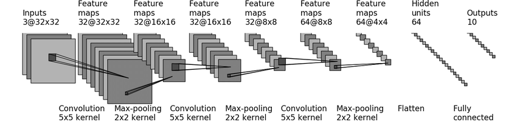

# pytorch-learning

> **date**: 2021.09.19
>
> **auther**: BlcDing
>
> **tag**: `python` `pytorch`

## 0.写在前面

### 视频教程链接

[pytorch learning](https://www.bilibili.com/video/BV1hE411t7RN)

### github源码链接

[pytorch-tutorial](https://github.com/xiaotudui/pytorch-tutorial)

### 获取pytorch安装命令

[获取安装命令](https://pytorch.org/get-started/locally/)

## 1.pytorch的一些工具

### Dataset

提供一种方式去获取数据及其label

- 如何获取每一个数据及其label
- 告诉我们总共有多少数据

```python
import os

from torch.utils.data import Dataset
from PIL import Image


class MyData(Dataset):
    
    def __init__(self, root_dir, label_dir):
        self.root_dir = root_dir
        self.label_dir = label_dir
        self.path = os.path.join(self.root_dir, self.label_dir)
        self.image_path = os.listdir(self.path)

    def __getitem__(self, index):
        image_name = self.image_path[index]
        image_item_path = os.path.join(self.root_dir, self.label_dir, image_name)
        image = Image.open(image_item_path)
        label = self.label_dir
        return image, label

    def __len__(self):
        return len(self.image_path)


root_dir = ""
ants_label_dir = "ants"
ants_dataset = MyData(root_dir, ants_label_dir)
bees_label_dir = "bees"
bees_dataset = MyData(root_dir, bees_label_dir)
train_dataset = ants_dataset + bees_dataset

image, label = ants_dataset[0]
image.show()
image, label = bees_dataset[0]
image.show()
```

### Dataloader

为后面的网络提供不同的数据形式

```python
import torchvision
from torch.utils.data import DataLoader
from torch.utils.tensorboard import SummaryWriter


test_data = torchvision.datasets.CIFAR10("./dataset", train=False, 
                                         transform=torchvision.transforms.ToTensor())
# batch_size: 每次取多少
# shuffle: 是否打乱
# num_workers: 使用几个进程，0表示只使用主进程
# drop_last: 是否丢弃不够一次batch_size的数据
test_loader = DataLoader(dataset=test_data, batch_size=64, shuffle=True,
                         num_workers=0, drop_last=True)

# 测试数据集中第一张图片及target
# tuple: (image, target) where target is index of the target class.
img, target = test_data[0]
print(img.shape)
print(target)

writer = SummaryWriter("dataloader")
for epoch in range(2):
    step = 0
    for data in test_loader:
        # 对每次batch_size取出的img进行打包，target进行打包
        imgs, targets = data
        # print(imgs.shape)
        # print(targets)
        writer.add_images("Epoch: {}".format(epoch), imgs, step)
        step = step + 1

writer.close()
```

### tensorboard 可视化

展示

```
pip install tensorboard
tensorboard --logdir=logs --port 6007
```

#### SummaryWriter.add_scalar

- 执行以下代码，获得`logs`数据
- `tensorboard --logdir=logs --port 6007`查看

```python
from torch.utils.tensorboard import SummaryWriter


writer = SummaryWriter("logs")
for i in range(100):
    writer.add_scalar("y=2x", 2*i, i)  #add_scalar(title, y_data, x_data)
writer.close()
```

#### SummaryWriter.add_image

```python
import numpy
from PIL import Image
from torch.utils.tensorboard import SummaryWriter


writer = SummaryWriter("logs")
image_path = ""
image_PIL = Image.open(image_path)
image_array = numpy.array(image_PIL)
print(type(image_array))
print(image_array.shape)  # (H, W, C) 高度，宽度，通道
writer.add_image("train", image_array, 1, dataformats='HWC')
writer.close()
```

### transforms

将特定格式图片进行处理的工具箱

#### ToTensor

> 转换成 => 神经网络使用的一种数据类型

```python
from PIL import Image
from torch.utils.tensorboard import SummaryWriter
from torchvision import transforms


image_path = ""
image = Image.open(image_path)
tensor_trans = transforms.ToTensor()
tensor_image = tensor_trans(image)
# print(tensor_image)
writer = SummaryWriter("logs")
writer.add_image("title", tensor_image)
writer.close()
```

#### Normalize

```python
from PIL import Image
from torch.utils.tensorboard import SummaryWriter
from torchvision import transforms


writer = SummaryWriter("logs")
image_path = ""
image = Image.open(image_path)
tensor_trans = transforms.ToTensor()
tensor_image = tensor_trans(image)
writer.add_image("title", tensor_image)

print(tensor_image[0][0][0])
normalize_trans = transforms.Normalize([0.5, 0.5, 0.5], [0.5, 0.5, 0.5])
normalize_image = normalize_trans(tensor_image)
print(normalize_image[0][0][0])
writer.add_image("normalize", normalize_image)

writer.close()
```

#### Resize

```python
from PIL import Image
from torch.utils.tensorboard import SummaryWriter
from torchvision import transforms


writer = SummaryWriter("logs")
image_path = ""
image = Image.open(image_path)
tensor_trans = transforms.ToTensor()

print(image.size)
resize_trans = transforms.Resize((512, 512))
resize_image = resize_trans(image)
resize_image = tensor_trans(resize_image)
writer.add_image("resize", resize_image)

writer.close()
```

#### Compose

```python
from PIL import Image
from torch.utils.tensorboard import SummaryWriter
from torchvision import transforms


writer = SummaryWriter("logs")
image_path = ""
image = Image.open(image_path)

tensor_trans = transforms.ToTensor()
resize_trans = transforms.Resize((512, 512))
compose = transforms.Compose([resize_trans, tensor_trans])
compose_image = compose(image)
writer.add_image("compose", compose_image)

writer.close()
```

#### RandomCrop

> 随机裁剪

```python
from PIL import Image
from torch.utils.tensorboard import SummaryWriter
from torchvision import transforms


writer = SummaryWriter("logs")
image_path = ""
image = Image.open(image_path)

tensor_trans = transforms.ToTensor()
random_crop_trans = transforms.RandomCrop((500, 1000))  # (512) => ((512, 512))
compose = transforms.Compose([random_crop_trans, tensor_trans])
for i in range(10):
    compose_image = compose(image)
    writer.add_image("random crop", compose_image, i)

writer.close()
```

### torchvision.datasets使用

> [datasets](https://pytorch.org/vision/stable/index.html)

```python
import torchvision
from torch.utils.tensorboard import SummaryWriter


dataset_transform = torchvision.transforms.Compose([
    torchvision.transforms.ToTensor()
])
train_set = torchvision.datasets.CIFAR10(root="./dataset", train=True, 
                                         transform=dataset_transform, download=True)
test_set = torchvision.datasets.CIFAR10(root="./dataset", train=False,
                                        transform=dataset_transform, download=True)

# 使用tensorboard进行显示
writer = SummaryWriter("logs")
for i in range(10):
    img, target = test_set[i]
    writer.add_image("test_set", img, i)
writer.close()
```

## 2.神经网络

### torch.nn.module

```python
import torch
from torch import nn


class Example(nn.Module):

    def __init__(self):
        super().__init__()

    def forward(self, input):  # 神经网络前向传播
        output = input + 1
        return output


example = Example()
input = torch.tensor(1.0)
output = example(input)
print(output)  # tensor(2.)
```

### Containers

#### torch.nn.Sequential



```python
import torch
from torch import nn
from torch.nn import Conv2d, MaxPool2d, Flatten, Linear, Sequential
from torch.utils.tensorboard import SummaryWriter


class Example(nn.Module):
    def __init__(self):
        super(Example, self).__init__()
        self.model1 = Sequential(
            Conv2d(in_channels=3, out_channels=32, kernel_size=5, stride=1, padding=2),
            MaxPool2d(kernel_size=2),
            Conv2d(32, 32, 5, padding=2),
            MaxPool2d(2),
            Conv2d(32, 64, 5, padding=2),
            MaxPool2d(2),
            Flatten(),
            Linear(1024, 64),
            Linear(64, 10)
        )

    def forward(self, x):
        x = self.model1(x)
        return x

example = Example()
print(example)

# 创建假想输入，检测网络正确性
input = torch.ones((64, 3, 32, 32))
output = example(input)
print(output.shape)

writer = SummaryWriter("../logs_seq")
# 可视化神经网络结构
writer.add_graph(example, input)
writer.close()
```

### Convolution Layers 神经网络卷积层

#### torch.nn.functional.conv2d 二维卷积操作（图像）

> [gif示例stride、padding](https://github.com/vdumoulin/conv_arithmetic/blob/master/README.md)

```python
import torch
import torch.nn.functional as F


# 输入
input = torch.tensor([[1, 2, 0, 3, 1],
                      [0, 1, 2, 3, 1],
                      [1, 2, 1, 0, 0],
                      [5, 2, 3, 1, 1],
                      [2, 1, 0, 1, 1]])
# 卷积核
kernel = torch.tensor([[1, 2, 1],
                       [0, 1, 0],
                       [2, 1, 0]])
print(input.shape)  # torch.Size([5, 5])
print(kernel.shape)  # torch.Size([3, 3])

# batch_size, channel, H, W
# reshape转换为规定格式的尺寸
input = torch.reshape(input, (1, 1, 5, 5))
kernel = torch.reshape(kernel, (1, 1, 3, 3))
print(input.shape)  # torch.Size([1, 1, 5, 5])
print(kernel.shape)  # torch.Size([1, 1, 3, 3])

# stride=1: 横向移动、纵向移动都为1
# 卷积，input和kernel先乘后加（矩阵乘）
output1 = F.conv2d(input, kernel, stride=1)
print(output1)

output2 = F.conv2d(input, kernel, stride=2)
print(output2)

# padding=1: 扩展5x5数据为7x7，扩充均为0（可以设置）
output3 = F.conv2d(input, kernel, stride=1, padding=1)
print(output3)
```

#### torch.nn.Conv2d 封装好的二维卷积

```python
import torch
import torchvision
from torch import nn
from torch.nn import Conv2d
from torch.utils.data import DataLoader
from torch.utils.tensorboard import SummaryWriter


dataset = torchvision.datasets.CIFAR10("./data", train=False, 
                                       transform=torchvision.transforms.ToTensor(),
                                       download=True)
dataloader = DataLoader(dataset, batch_size=64)


class Example(nn.Module):
    
    def __init__(self):
        super(Example, self).__init__()
        # out_channels=6: 生成6个卷积核
        self.conv1 = Conv2d(in_channels=3, out_channels=6,
                            kernel_size=3, stride=1, padding=0)
        
    def forward(self, x):
        x = self.conv1(x)
        return x

    
example = Example()
writer = SummaryWriter("./logs")
step = 0
for data in dataloader:
    imgs, targets = data
    output = example(imgs)
    print(imgs.shape)
    print(output.shape)
    # torch.Size([64, 3, 32, 32])
    writer.add_images("input", imgs, step)
    # torch.Size([64, 6, 30, 30])  -> [xxx, 3, 30, 30]
    # 彩色图片3个通道，6个通道无法输出，需要reshape处理
    # xxx未知时，直接写-1，会根据后面的值进行计算
    output = torch.reshape(output, (-1, 3, 30, 30))  
    writer.add_images("output", output, step)
    step = step + 1
writer.close()
```

### Pooling Layers 神经网络池化层

减少数据量

```python
import torch
import torchvision
from torch import nn
from torch.nn import MaxPool2d
from torch.utils.data import DataLoader
from torch.utils.tensorboard import SummaryWriter


dataset = torchvision.datasets.CIFAR10("../data", train=False, download=True,
                                       transform=torchvision.transforms.ToTensor())
dataloader = DataLoader(dataset, batch_size=64)

class Example(nn.Module):
    
    def __init__(self):
        super(Example, self).__init__()
        # maxpool下采样，最大池化，取池化核范围内最大值
        # kernel_size，池化核的大小
        # stride，默认=kernel_size
        # ceil_mode=False -> floor 向下取整
        # ceil_mode=True -> ceil 向上取整
        self.maxpool1 = MaxPool2d(kernel_size=3, ceil_mode=False)

    def forward(self, input):
        output = self.maxpool1(input)
        return output

example = Example()
writer = SummaryWriter("../logs_maxpool")
step = 0
for data in dataloader:
    imgs, targets = data
    writer.add_images("input", imgs, step)
    output = example(imgs)
    writer.add_images("output", output, step)
    step = step + 1
writer.close()
```

### Padding Layers 神经网络填充层

与卷积层、池化层的padding参数作用一致

### Non-linear Activations 非线性激活

给神经网络引入非线性特质

#### torch.nn.ReLU

#### torch.nn.Sigmoid

```python
import torch
import torchvision
from torch import nn
from torch.nn import ReLU, Sigmoid
from torch.utils.data import DataLoader
from torch.utils.tensorboard import SummaryWriter


input = torch.tensor([[1, -0.5],
                      [-1, 3]])
input = torch.reshape(input, (-1, 1, 2, 2))
print(input.shape)

dataset = torchvision.datasets.CIFAR10("../data", train=False, download=True,
                                       transform=torchvision.transforms.ToTensor())
dataloader = DataLoader(dataset, batch_size=64)


class Example(nn.Module):
    
    def __init__(self):
        super(Example, self).__init__()
        # ReLU(inplace=False) inplace指是否原地替换，把output赋值给input
        # ReLU: input<0 -> output=0
        #       input>=0 -> output=input
        self.relu1 = ReLU()
        self.sigmoid1 = Sigmoid()

    def forward(self, input):
        # output = self.relu1(input)
        output = self.sigmoid1(input)
        return output

example = Example()
writer = SummaryWriter("../logs")
step = 0
for data in dataloader:
    imgs, targets = data
    writer.add_images("input", imgs, global_step=step)
    output = example(imgs)
    writer.add_images("output", output, step)
    step += 1
writer.close()
```

### Normalization Layers 神经网络正则化层

### Recurrent Layers （主要用于文字识别（nlp自然语言处理

### Transformer Layers

### Linear Layers 神经网络线性层

```python
import torch
import torchvision
from torch import nn
from torch.nn import Linear
from torch.utils.data import DataLoader


dataset = torchvision.datasets.CIFAR10("../data", train=False, transform=torchvision.transforms.ToTensor(),
                                       download=True)
dataloader = DataLoader(dataset, batch_size=64, drop_last=True)


class Example(nn.Module):

    def __init__(self):
        super(Example, self).__init__()
        self.linear1 = Linear(196608, 10)

    def forward(self, input):
        output = self.linear1(input)
        return output

example = Example()
for data in dataloader:
    imgs, targets = data
    print(imgs.shape)
    output = torch.flatten(imgs)  # 摊平，展成一行
    print(output.shape)
    output = example(output)
    print(output.shape)
```

### Dropout Layers

防止过拟合，根据概率`p`随机把一些input改为0

### Sparse Layers （用于nlp

### Distance Functions

计算两个值之间的误差是通过什么方式衡量的

### Loss Functions 损失函数

1. 计算实际输出和目标之间的差距
2. 为我们更新输出提供一定的依据（反向传播）

#### torch.nn.L1Loss

```python
import torch
from torch.nn import L1Loss
from torch import nn


inputs = torch.tensor([1, 2, 3], dtype=torch.float32)
targets = torch.tensor([1, 2, 5], dtype=torch.float32)

inputs = torch.reshape(inputs, (1, 1, 1, 3))
targets = torch.reshape(targets, (1, 1, 1, 3))

# reduction={'none', 'sum', 'mean'(default)} 对应不同的计算损失的公式
loss = L1Loss()
result = loss(inputs, targets)
print(result)
loss = L1Loss(reduction='sum')
result = loss(inputs, targets)
print(result)
loss = L1Loss(reduction='none')
result = loss(inputs, targets)
print(result)
```

#### torch.nn.MSELoss 平方差 mean square error

```python
import torch
from torch.nn import L1Loss, MSELoss


inputs = torch.tensor([1, 2, 3], dtype=torch.float32)
targets = torch.tensor([1, 2, 5], dtype=torch.float32)

inputs = torch.reshape(inputs, (1, 1, 1, 3))
targets = torch.reshape(targets, (1, 1, 1, 3))

loss_mse = MSELoss()
result_mse = loss_mse(inputs, targets)
print(result_mse)
```

#### torch.nn.CrossEntropyLoss 交叉熵（分类问题

```python
import torchvision
from torch import nn
from torch.nn import Conv2d, MaxPool2d, Flatten, Linear, Sequential
from torch.utils.data import DataLoader
from torch.utils.tensorboard import SummaryWriter


dataset = torchvision.datasets.CIFAR10("../data", train=False, transform=torchvision.transforms.ToTensor(),
                                       download=True)

dataloader = DataLoader(dataset, batch_size=1)


class Example(nn.Module):
    def __init__(self):
        super(Example, self).__init__()
        self.model1 = Sequential(
            Conv2d(in_channels=3, out_channels=32, kernel_size=5, stride=1, padding=2),
            MaxPool2d(kernel_size=2),
            Conv2d(32, 32, 5, padding=2),
            MaxPool2d(2),
            Conv2d(32, 64, 5, padding=2),
            MaxPool2d(2),
            Flatten(),
            Linear(1024, 64),
            Linear(64, 10)
        )

    def forward(self, x):
        x = self.model1(x)
        return x

example = Example()
loss = nn.CrossEntropyLoss()
for data in dataloader:
    imgs, targets = data
    outputs = example(imgs)
    result_loss = loss(outputs, targets)
    # 反向传播，计算每个需要调节的参数的梯度（gradient），再使用优化器根据梯度对参数进行调整，实现降低误差的目的
    result_loss.backward()
    print("ok")
```

### torch.optim 优化器

```python
import torch
import torchvision
from torch import nn
from torch.nn import Conv2d, MaxPool2d, Flatten, Linear, Sequential
from torch.utils.data import DataLoader
from torch.optim.lr_scheduler import StepLR
from torch.utils.tensorboard import SummaryWriter


dataset = torchvision.datasets.CIFAR10("../data", train=False, transform=torchvision.transforms.ToTensor(),
                                       download=True)

dataloader = DataLoader(dataset, batch_size=1)


class Example(nn.Module):
    def __init__(self):
        super(Example, self).__init__()
        self.model1 = Sequential(
            Conv2d(in_channels=3, out_channels=32, kernel_size=5, stride=1, padding=2),
            MaxPool2d(kernel_size=2),
            Conv2d(32, 32, 5, padding=2),
            MaxPool2d(2),
            Conv2d(32, 64, 5, padding=2),
            MaxPool2d(2),
            Flatten(),
            Linear(1024, 64),
            Linear(64, 10)
        )

    def forward(self, x):
        x = self.model1(x)
        return x

example = Example()
loss = nn.CrossEntropyLoss()
# optimizer 优化器
# torch.optim.SGD 优化算法
# lr=learning rate学习率，设置过大模型不稳定，设置过小训练速度慢
optim = torch.optim.SGD(example.parameters(), lr=0.01)
for epoch in range(20):  # 进行20轮学习
    running_loss = 0.0
    for data in dataloader:
        imgs, targets = data
        outputs = example(imgs)
        result_loss = loss(outputs, targets)
        optim.zero_grad()  # 梯度清零
        result_loss.backward()  # 反向传播，计算梯度（gradient）
        optim.step()  # 对模型参数进行调优
        running_loss += result_loss  # 求每一轮学习的loss总和
    print(running_loss)
```

## 3.pytorch中提供的网络模型

### torchvision.models.vgg16

```python
import torchvision
from torch import nn

# train_data = torchvision.datasets.ImageNet("../data_image_net", split='train', download=True,
#                                            transform=torchvision.transforms.ToTensor())

vgg16_false = torchvision.models.vgg16(pretrained=False)
# pretrained=True 参数进行了预训练
vgg16_true = torchvision.models.vgg16(pretrained=True)
print(vgg16_true)


# 现有网络模型的修改
# 10类的CIFAR10，应用分1000类的vgg16
train_data = torchvision.datasets.CIFAR10('../data', train=True, transform=torchvision.transforms.ToTensor(),
                                          download=True)

# No.1 加一个线性层
# in_features=1000, out_features=10
vgg16_true.classifier.add_module('add_linear', nn.Linear(1000, 10))
print(vgg16_true)

# No.2 修改现有线性层
print(vgg16_false)
vgg16_false.classifier[6] = nn.Linear(4096, 10)
print(vgg16_false)
```

## 4.网络模型的保存与加载

```python
import torch
import torchvision
from torch import nn


vgg16 = torchvision.models.vgg16(pretrained=False)

# 保存方式1，模型结构+模型参数
torch.save(vgg16, "vgg16_method1.pth")
# 加载方式1
model = torch.load("vgg16_method1.pth")
print(model)

# 保存方式2，模型参数（官方推荐）
torch.save(vgg16.state_dict(), "vgg16_method2.pth")
# 加载方式2
# model = torch.load("vgg16_method2.pth")
# print(model)
vgg16 = torchvision.models.vgg16(pretrained=False)
vgg16.load_state_dict(torch.load("vgg16_method2.pth"))
print(vgg16)


# 陷阱
class Example(nn.Module):

    def __init__(self):
        super(Example, self).__init__()
        self.conv1 = nn.Conv2d(3, 64, kernel_size=3)

    def forward(self, x):
        x = self.conv1(x)
        return x


example = Example()
torch.save(example, "example_method1.pth")
# 使用方式1保存，再重新引入，如果当前源码没有Example，会报错
```

## 5.完整的模型训练套路

### 搭建神经网络

```python
# model.py
import torch
from torch import nn


# 搭建神经网络
class Example(nn.Module):
    def __init__(self):
        super(Example, self).__init__()
        self.model = nn.Sequential(
            nn.Conv2d(3, 32, 5, 1, 2),
            nn.MaxPool2d(2),
            nn.Conv2d(32, 32, 5, 1, 2),
            nn.MaxPool2d(2),
            nn.Conv2d(32, 64, 5, 1, 2),
            nn.MaxPool2d(2),
            nn.Flatten(),
            nn.Linear(64*4*4, 64),
            nn.Linear(64, 10)
        )

    def forward(self, x):
        x = self.model(x)
        return x


if __name__ == "__main__":
    # 测试网络尺寸正确性
    example = Example()
    input = torch.ones((64, 3, 32, 32))
    output = tudui(input)
    print(output.shape)
```

### 网络模型训练

```python
import torch
import torchvision
from torch import nn
from torch.utils.tensorboard import SummaryWriter
from torch.utils.data import DataLoader

from model import *  # 引入模型


# 准备数据集
train_data = torchvision.datasets.CIFAR10(root="../data", train=True, 
                                          transform=torchvision.transforms.ToTensor(),
                                          download=True)
test_data = torchvision.datasets.CIFAR10(root="../data", train=False, 
                                         transform=torchvision.transforms.ToTensor(),
                                         download=True)

train_data_size = len(train_data)
test_data_size = len(test_data)
print("训练数据集的长度为：{}".format(train_data_size))
print("测试数据集的长度为：{}".format(test_data_size))


# 利用 DataLoader 来加载数据集
train_dataloader = DataLoader(train_data, batch_size=64)
test_dataloader = DataLoader(test_data, batch_size=64)


# 创建网络模型
example = Example()


# 损失函数
loss_fn = nn.CrossEntropyLoss()


# 优化器 （SGD 随机梯度下降
# learning_rate = 0.01
learning_rate = 1e-2  # 1e-2 = 1 x (10)^(-2) = 1 /100 = 0.01
optimizer = torch.optim.SGD(example.parameters(), lr=learning_rate)


# 设置训练网络的一些参数
total_train_step = 0  # 记录训练的次数
total_test_step = 0  # 记录测试的次数
epoch = 10  # 训练的轮数


# 添加tensorboard
writer = SummaryWriter("../logs_train")


for i in range(epoch):
    print("-------第 {} 轮训练开始-------".format(i+1))

    # 训练步骤开始
    example.train()  # 只对某些层有作用
    for data in train_dataloader:
        imgs, targets = data
        outputs = example(imgs)
        loss = loss_fn(outputs, targets)

        # 优化器优化模型
        optimizer.zero_grad()
        loss.backward()
        optimizer.step()

        total_train_step += 1
        if total_train_step % 100 == 0:
            print("训练次数：{}, Loss: {}".format(total_train_step, loss.item()))
            writer.add_scalar("train_loss", loss.item(), total_train_step)

    # 测试步骤开始
    example.eval()  # 只对某些层有作用
    total_test_loss = 0
    total_accuracy = 0
    with torch.no_grad():
        for data in test_dataloader:
            imgs, targets = data
            outputs = example(imgs)
            loss = loss_fn(outputs, targets)
            total_test_loss +=  loss.item()
            # 准确率
            # argmax 取概率最大值的位置
            # accuracy: 测试正确个数 total_accuracy: 测试正确总个数
            accuracy = (outputs.argmax(1) == targets).sum()
            total_accuracy += accuracy

    print("整体测试集上的Loss: {}".format(total_test_loss))
    print("整体测试集上的正确率: {}".format(total_accuracy/test_data_size))
    writer.add_scalar("test_loss", total_test_loss, total_test_step)
    # total_accuracy/test_data_size: 测试正确率
    writer.add_scalar("test_accuracy", total_accuracy/test_data_size, total_test_step)
    total_test_step += 1


    # 保存每一轮训练的模型
    torch.save(example, "example_{}.pth".format(i))
    # torch.save(example.state_dict(), "example_{}.pth".format(i))  # 官方推荐
    print("模型已保存")

writer.close()
```

## 6.利用GPU训练

网络模型、损失函数、数据 => `.cuda()`

### 方法一

```python
import torch
import torchvision
from torch import nn
from torch.utils.data import DataLoader
from torch.utils.tensorboard import SummaryWriter


train_data = torchvision.datasets.CIFAR10(root="../data", train=True, 
                                          transform=torchvision.transforms.ToTensor(),
                                          download=True)
test_data = torchvision.datasets.CIFAR10(root="../data", train=False, 
                                         transform=torchvision.transforms.ToTensor(),
                                         download=True)

train_data_size = len(train_data)
test_data_size = len(test_data)
print("训练数据集的长度为：{}".format(train_data_size))
print("测试数据集的长度为：{}".format(test_data_size))


train_dataloader = DataLoader(train_data, batch_size=64)
test_dataloader = DataLoader(test_data, batch_size=64)


class Example(nn.Module):
    def __init__(self):
        super(Example, self).__init__()
        self.model = nn.Sequential(
            nn.Conv2d(3, 32, 5, 1, 2),
            nn.MaxPool2d(2),
            nn.Conv2d(32, 32, 5, 1, 2),
            nn.MaxPool2d(2),
            nn.Conv2d(32, 64, 5, 1, 2),
            nn.MaxPool2d(2),
            nn.Flatten(),
            nn.Linear(64*4*4, 64),
            nn.Linear(64, 10)
        )

    def forward(self, x):
        x = self.model(x)
        return x


example = Example()
# 如果GPU可用，使用GPU
if torch.cuda.is_available():
    example = example.cuda()

    
loss_fn = nn.CrossEntropyLoss()
if torch.cuda.is_available():
    loss_fn = loss_fn.cuda()


learning_rate = 1e-2
optimizer = torch.optim.SGD(example.parameters(), lr=learning_rate)


total_train_step = 0  # 记录训练的次数
total_test_step = 0  # 记录测试的次数
epoch = 10  # 训练的轮数


writer = SummaryWriter("../logs_train")


for i in range(epoch):
    print("-------第 {} 轮训练开始-------".format(i+1))

    # 训练步骤开始
    example.train()
    for data in train_dataloader:
        imgs, targets = data
        if torch.cuda.is_available():
            imgs = imgs.cuda()
            targets = targets.cuda()
        outputs = example(imgs)
        loss = loss_fn(outputs, targets)

        # 优化器优化模型
        optimizer.zero_grad()
        loss.backward()
        optimizer.step()

        total_train_step = total_train_step + 1
        if total_train_step % 100 == 0:
            print("训练次数：{}, Loss: {}".format(total_train_step, loss.item()))
            writer.add_scalar("train_loss", loss.item(), total_train_step)

    # 测试步骤开始
    example.eval()
    total_test_loss = 0
    total_accuracy = 0
    with torch.no_grad():
        for data in test_dataloader:
            imgs, targets = data
            if torch.cuda.is_available():
                imgs = imgs.cuda()
                targets = targets.cuda()
            outputs = example(imgs)
            loss = loss_fn(outputs, targets)
            total_test_loss = total_test_loss + loss.item()
            accuracy = (outputs.argmax(1) == targets).sum()
            total_accuracy = total_accuracy + accuracy

    print("整体测试集上的Loss: {}".format(total_test_loss))
    print("整体测试集上的正确率: {}".format(total_accuracy/test_data_size))
    writer.add_scalar("test_loss", total_test_loss, total_test_step)
    writer.add_scalar("test_accuracy", total_accuracy/test_data_size, total_test_step)
    total_test_step = total_test_step + 1

    torch.save(example, "example_{}.pth".format(i))
    print("模型已保存")

writer.close()
```

### 方法二

```python
# 定义训练的设备
# device = torch.device("cpu")
device = torch.device("cuda")
# device = torch.device("cuda:0")  # 第一张显卡
# device = torch.device("cuda:1")  # 第二张显卡
device = torch.device("cuda" if torch.cuda.is_available() else "cpu")


# 可以不另外赋值
example = example.to(device)
example.to(device)
loss_fn = loss_fn.to(device)
loss_fn.to(device)

# 必须另外赋值
imgs = imgs.to(device)
targets = targets.to(device)
```

## 7.完整的模型验证套路

利用已经训练好的模型，给它提供输入

```python
import torch
import torchvision
from PIL import Image
from torch import nn

image_path = "../imgs/airplane.png"
image = Image.open(image_path)
print(image)
image = image.convert('RGB')  # png是4通道
transform = torchvision.transforms.Compose([torchvision.transforms.Resize((32, 32)),
                                            torchvision.transforms.ToTensor()])

image = transform(image)
print(image.shape)


class Example(nn.Module):
    def __init__(self):
        super(Example, self).__init__()
        self.model = nn.Sequential(
            nn.Conv2d(3, 32, 5, 1, 2),
            nn.MaxPool2d(2),
            nn.Conv2d(32, 32, 5, 1, 2),
            nn.MaxPool2d(2),
            nn.Conv2d(32, 64, 5, 1, 2),
            nn.MaxPool2d(2),
            nn.Flatten(),
            nn.Linear(64*4*4, 64),
            nn.Linear(64, 10)
        )

    def forward(self, x):
        x = self.model(x)
        return x


# 使用在GPU上训练的模型时，如果运行在cpu的环境中，需要设置map_location=torch.device('cpu'
model = torch.load("example_29_gpu.pth", map_location=torch.device('cpu'))
print(model)
image = torch.reshape(image, (1, 3, 32, 32))
model.eval()
with torch.no_grad():
    output = model(image)
print(output)
print(output.argmax(1))
```

# ===========ps===========:

### help(Dataset)

```python
Help on class Dataset in module torch.utils.data.dataset:

class Dataset(typing.Generic)
 |  Dataset(*args, **kwds)
 |
 |  An abstract class representing a :class:`Dataset`.
 |
 |  All datasets that represent a map from keys to data samples should subclass
 |  it. All subclasses should overwrite :meth:`__getitem__`, supporting fetching a
 |  data sample for a given key. Subclasses could also optionally overwrite
 |  :meth:`__len__`, which is expected to return the size of the dataset by many
 |  :class:`~torch.utils.data.Sampler` implementations and the default options
 |  of :class:`~torch.utils.data.DataLoader`.
 |
 |  .. note::
 |    :class:`~torch.utils.data.DataLoader` by default constructs a index
 |    sampler that yields integral indices.  To make it work with a map-style
 |    dataset with non-integral indices/keys, a custom sampler must be provided.
 |
 |  Method resolution order:
 |      Dataset
 |      typing.Generic
 |      builtins.object
 |
 |  Methods defined here:
 |
 |
 |  __getitem__(self, index) -> +T_co
 |
 |  Data descriptors defined here:
 |
 |  __dict__
 |      dictionary for instance variables (if defined)
 |
 |  __weakref__
 |      list of weak references to the object (if defined)
 |
 |  Data and other attributes defined here:
 |
 |  __orig_bases__ = (typing.Generic[+T_co],)
 |
 |  __parameters__ = (+T_co,)
 |
 |  Class methods inherited from typing.Generic:
 |
 |  __class_getitem__(params) from builtins.type
 |
 |  __init_subclass__(*args, **kwargs) from builtins.type
 |      This method is called when a class is subclassed.
 |
 |      The default implementation does nothing. It may be
 |      overridden to extend subclasses.
 |
 |  Static methods inherited from typing.Generic:
 |
 |  __new__(cls, *args, **kwds)
 |      Create and return a new object.  See help(type) for accurate signature.
```

### help(SummaryWriter.add_scalar)

```python
Help on function add_scalar in module torch.utils.tensorboard.writer:

add_scalar(self, tag, scalar_value, global_step=None, walltime=None, new_style=False)
    Add scalar data to summary.

    Args:
        tag (string): Data identifier
        scalar_value (float or string/blobname): Value to save
        global_step (int): Global step value to record
        walltime (float): Optional override default walltime (time.time())
          with seconds after epoch of event
        new_style (boolean): Whether to use new style (tensor field) or old
          style (simple_value field). New style could lead to faster data loading.
    Examples::

        from torch.utils.tensorboard import SummaryWriter
        writer = SummaryWriter()
        x = range(100)
        for i in x:
            writer.add_scalar('y=2x', i * 2, i)
        writer.close()
```

### help(SummaryWriter.add_image)

```python
Help on function add_image in module torch.utils.tensorboard.writer:

add_image(self, tag, img_tensor, global_step=None, walltime=None, dataformats='CHW')
    Add image data to summary.

    Note that this requires the ``pillow`` package.

    Args:
        tag (string): Data identifier
        img_tensor (torch.Tensor, numpy.array, or string/blobname): Image data
        global_step (int): Global step value to record
        walltime (float): Optional override default walltime (time.time())
          seconds after epoch of event
    Shape:
        img_tensor: Default is :math:`(3, H, W)`. You can use ``torchvision.utils.make_grid()`` to
        convert a batch of tensor into 3xHxW format or call ``add_images`` and let us do the job.
        Tensor with :math:`(1, H, W)`, :math:`(H, W)`, :math:`(H, W, 3)` is also suitable as long as
        corresponding ``dataformats`` argument is passed, e.g. ``CHW``, ``HWC``, ``HW``.

    Examples::

        from torch.utils.tensorboard import SummaryWriter
        import numpy as np
        img = np.zeros((3, 100, 100))
        img[0] = np.arange(0, 10000).reshape(100, 100) / 10000
        img[1] = 1 - np.arange(0, 10000).reshape(100, 100) / 10000

        img_HWC = np.zeros((100, 100, 3))
        img_HWC[:, :, 0] = np.arange(0, 10000).reshape(100, 100) / 10000
        img_HWC[:, :, 1] = 1 - np.arange(0, 10000).reshape(100, 100) / 10000

        writer = SummaryWriter()
        writer.add_image('my_image', img, 0)

        # If you have non-default dimension setting, set the dataformats argument.
        writer.add_image('my_image_HWC', img_HWC, 0, dataformats='HWC')
        writer.close()

    Expected result:

    .. image:: _static/img/tensorboard/add_image.png
       :scale: 50 %
```

### help(transforms.ToTensor)

```python
Help on class ToTensor in module torchvision.transforms.transforms:

class ToTensor(builtins.object)
 |  Convert a ``PIL Image`` or ``numpy.ndarray`` to tensor. This transform does not support torchscript.
 |
 |  Converts a PIL Image or numpy.ndarray (H x W x C) in the range
 |  [0, 255] to a torch.FloatTensor of shape (C x H x W) in the range [0.0, 1.0]
 |  if the PIL Image belongs to one of the modes (L, LA, P, I, F, RGB, YCbCr, RGBA, CMYK, 1)
 |  or if the numpy.ndarray has dtype = np.uint8
 |
 |  In the other cases, tensors are returned without scaling.
 |
 |  .. note::
 |      Because the input image is scaled to [0.0, 1.0], this transformation should not be used when
 |      transforming target image masks. See the `references`_ for implementing the transforms for image masks.
 |
 |  .. _references: https://github.com/pytorch/vision/tree/master/references/segmentation
 |
 |  Methods defined here:
 |
 |  __call__(self, pic)
 |      Args:
 |          pic (PIL Image or numpy.ndarray): Image to be converted to tensor.
 |
 |      Returns:
 |          Tensor: Converted image.
 |
 |  __repr__(self)
 |      Return repr(self).
 |
 |  ----------------------------------------------------------------------
 |  Data descriptors defined here:
 |
 |  __dict__
 |      dictionary for instance variables (if defined)
 |
 |  __weakref__
 |      list of weak references to the object (if defined)
```

### help(transforms.Normalize)

```python
Help on class Normalize in module torchvision.transforms.transforms:

class Normalize(torch.nn.modules.module.Module)
 |  Normalize(mean, std, inplace=False)
 |
 |  Normalize a tensor image with mean and standard deviation.
 |  This transform does not support PIL Image.
 |  Given mean: ``(mean[1],...,mean[n])`` and std: ``(std[1],..,std[n])`` for ``n``
 |  channels, this transform will normalize each channel of the input
 |  ``torch.*Tensor`` i.e.,
 |  ``output[channel] = (input[channel] - mean[channel]) / std[channel]``
 |
 |  .. note::
 |      This transform acts out of place, i.e., it does not mutate the input tensor.
 |
 |  Args:
 |      mean (sequence): Sequence of means for each channel.
 |      std (sequence): Sequence of standard deviations for each channel.
 |      inplace(bool,optional): Bool to make this operation in-place.
```

