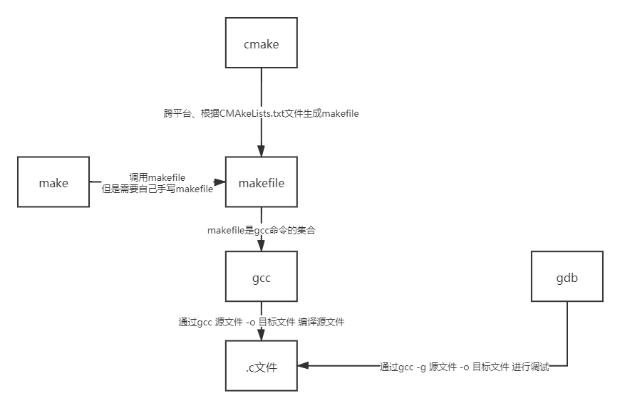

 .c gcc make makefile cmake gdb关系

***.c***是C语言的源文件，是指未经编译的，按照一定的程序设计语言规范书写的，人类可读的文本文件。

***gcc***是GNU Compiler Collection（就是GNU编译器套件），也可以简单认为是***编译器***。

当你的程序只有一个源文件时，直接就可以用gcc命令编译它，但是当你的程序包含很多个源文件时，用gcc命令逐个去编译时，你就很容易混乱而且工作量大，所以出现了***make工具***

***make工具***可以看成是一个智能的批处理工具，它本身并没有编译和链接的功能，而是用类似于批处理的方式—通过***调用makefile文件***中用户指定的命令来进行编译和链接的。

***makefile文件***包含了调用gcc的命令，可以理解为是***指令清单***，make工具根据这个清单进行执行命令

makefile在一些简单的工程完全可以人工手下，但是当工程非常大的时候，手写makefile也是非常麻烦的，如果换了个平台makefile又要重新修改。这时候就出现了***Cmake***这个工具，cmake就可以更加简单的生成makefile文件给上面那个make用。当然cmake还有其他功能，就是可以***跨平台***生成对应平台能用的makefile，你不用再自己去修改了。

cmake根据CMAkeLists.txt文件生成makefile

gdb是调试器 

启动的话必须利用

```shell
gcc -g 源文件.c -o 输出的目标文件
```

（gdb）help：查看命令帮助，具体命令查询在gdb中输入help + 命令,简写h

（gdb）run：重新开始运行文件（run-text：加载文本文件，run-bin：加载二进制文件）,简写r

（gdb）start：单步执行，运行程序，停在第一执行语句

（gdb）list：查看原代码（list-n,从第n行开始查看代码。list+ 函数名：查看具体函数）,简写l

（gdb）set：设置变量的值

（gdb）next：单步调试（逐过程，函数直接执行）,简写n

（gdb）step：单步调试（逐语句：跳入自定义函数内部执行）,简写s

（gdb）backtrace：查看函数的调用的栈帧和层级关系,简写bt

（gdb）frame：切换函数的栈帧,简写f

（gdb）info：查看函数内部局部变量的数值,简写i

（gdb）finish：结束当前函数，返回到函数调用点

（gdb）continue：继续运行,简写c




