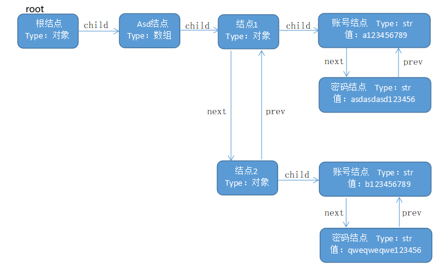
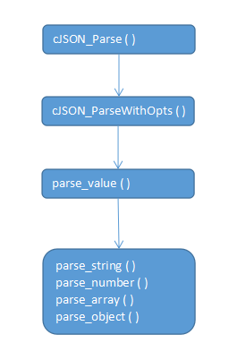
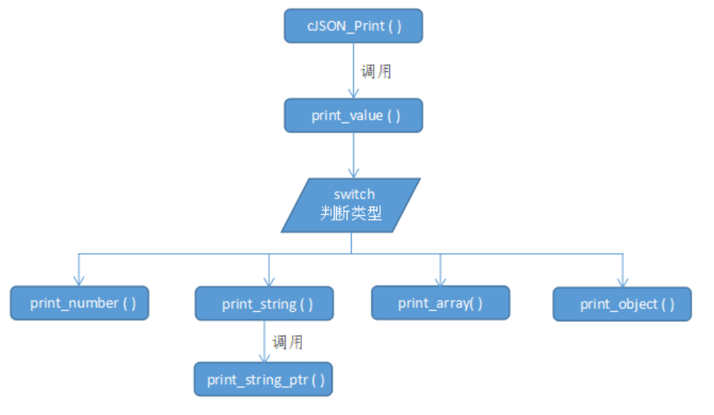

# 1 简介

JSON(JavaScript Object Notation, JS 对象简谱) 是一种轻量级的数据交换格式。它基于 ECMAScript (欧洲计算机协会制定的js规范)的一个子集，采用完全独立于编程语言的文本格式来存储和表示数据。简洁和清晰的层次结构使得 JSON 成为理想的数据交换语言。 易于人阅读和编写，同时也易于机器解析和生成，并有效地提升网络传输效率。cJSON从名字可知，整个项目都是以极标准的C来写的，意思说，可以跨各种平台使用了。cJSON是一个超轻巧，携带方便，单文件，简单的可以作为ANSI-C标准的JSON解析器。

下载方式 https://sourceforge.net/projects/cjson/


# 2 cJson.h解析

```c
#ifndef cJSON__h
#define cJSON__h
 
#ifdef __cplusplus
extern "C"
//extern "C"的主要作用就是为了能够正确实现C++代码调用其他C语言代码。加上extern "C"后，
//会指示编译器这部分代码按C语言的进行编译，而不是C++的。由于C++支持函数重载，因此编译
//器编译函数的过程中会将函数的参数类型也加到编译后的代码中，而不仅仅是函数名；而C语言
//并不支持函数重载，因此编译C语言代码的函数时不会带上函数的参数类型，一般之包括函数名。
{
#endif
 
/* cJSON Types: */
#define cJSON_False 0
#define cJSON_True 1
#define cJSON_NULL 2
#define cJSON_Number 3
#define cJSON_String 4
#define cJSON_Array 5
#define cJSON_Object 6
	
#define cJSON_IsReference 256
#define cJSON_StringIsConst 512
 
/* cJSON结构体: */
typedef struct cJSON {
	struct cJSON *next,*prev;	/* next/prev结构体指针允许你遍历数组/对象链。另外,使用GetArraySize 、 GetArrayItem 、 GetObjectItem方法获取相应的项。 */
	struct cJSON *child;		/* 数组或对象将有一个child指针指向数组/对象中的头结点。 */
 
	int type;			/* 项的类型 */
 
	char *valuestring;	        /* 如果type==cJSON_String，则是字符串。 */
	int valueint;		        /* 如果type==cJSON_Number，则是int。 */
	double valuedouble;	        /* 如果type==cJSON_Number，则是double。 */
 
	char *string;		        /* json对象的名称。 */
} cJSON;
 
/* 该结构体提供了分配和释放空间的函数指针 */
typedef struct cJSON_Hooks {
      void *(*malloc_fn)(size_t sz);
      void (*free_fn)(void *ptr);
} cJSON_Hooks;
 
/* 向cJSON提供malloc和free函数 */
extern void cJSON_InitHooks(cJSON_Hooks* hooks);
 
 
/* 提供一个JSON块，然后返回一个可以查询的cJSON对象。完成后调用cJSON_Delete。 */
extern cJSON *cJSON_Parse(const char *value);
/* 将cJSON实体呈现为用于传输/存储的文本。完成后释放char*。 */
extern char  *cJSON_Print(cJSON *item);
/* 将cJSON实体呈现为用于传输/存储的文本，而不进行任何格式化。完成后释放char*。 */
extern char  *cJSON_PrintUnformatted(cJSON *item);
/* 使用缓冲策略将cJSON实体呈现为文本。预缓冲是对最终大小的猜测。猜测减少了重新分配。fmt=0表示无格式，=1表示有格式 */
extern char *cJSON_PrintBuffered(cJSON *item,int prebuffer,int fmt);
/* 删除一个cJSON实体和所有子实体。 */
extern void   cJSON_Delete(cJSON *c);
 
/* 返回数组(或对象)中的项数。 */
extern int	  cJSON_GetArraySize(cJSON *array);
/* 从数组“数组”中检索项目编号“项目”。如果不成功，返回NULL。 */
extern cJSON *cJSON_GetArrayItem(cJSON *array,int item);
/* 从对象中获取项目"string"。不区分大小写。 */
extern cJSON *cJSON_GetObjectItem(cJSON *object,const char *string);
 
/* 用于分析失败的语法。这将返回一个指向解析错误的指针。
你可能需要回头看几个字才能理解它。当cJSON_Parse()返回0时定义。当cJSON_Parse()成功时为0。 */
extern const char *cJSON_GetErrorPtr(void);
	
/* 这些调用创建适当Type的cJSON项。 */
extern cJSON *cJSON_CreateNull(void);
extern cJSON *cJSON_CreateTrue(void);
extern cJSON *cJSON_CreateFalse(void);
extern cJSON *cJSON_CreateBool(int b);
extern cJSON *cJSON_CreateNumber(double num);
extern cJSON *cJSON_CreateString(const char *string);
extern cJSON *cJSON_CreateArray(void);
extern cJSON *cJSON_CreateObject(void);
 
/* 根据count创建数组。 */
extern cJSON *cJSON_CreateIntArray(const int *numbers,int count);
extern cJSON *cJSON_CreateFloatArray(const float *numbers,int count);
extern cJSON *cJSON_CreateDoubleArray(const double *numbers,int count);
extern cJSON *cJSON_CreateStringArray(const char **strings,int count);
 
/* 向指定的数组/对象追加项。 */
extern void cJSON_AddItemToArray(cJSON *array, cJSON *item);
extern void	cJSON_AddItemToObject(cJSON *object,const char *string,cJSON *item);
extern void	cJSON_AddItemToObjectCS(cJSON *object,const char *string,cJSON *item);	/* 当字符串确实是常量(例如，是一个文本，或者与常量一样好)，并且肯定会在cJSON对象中存活时，就使用这个方法 */
/* 将对项的引用追加到指定的数组/对象。当您想要将现有的cJSON添加到新的cJSON中，但又不想破坏现有的cJSON时，可以使用此方法。 */
extern void cJSON_AddItemReferenceToArray(cJSON *array, cJSON *item);
extern void	cJSON_AddItemReferenceToObject(cJSON *object,const char *string,cJSON *item);
 
/* 从数组/对象中删除/分离项。 */
extern cJSON *cJSON_DetachItemFromArray(cJSON *array,int which);
extern void   cJSON_DeleteItemFromArray(cJSON *array,int which);
extern cJSON *cJSON_DetachItemFromObject(cJSON *object,const char *string);
extern void   cJSON_DeleteItemFromObject(cJSON *object,const char *string);
	
/* 更新数组项 */
extern void cJSON_InsertItemInArray(cJSON *array,int which,cJSON *newitem);	/* 将已存在的项目向右移动。 */
extern void cJSON_ReplaceItemInArray(cJSON *array,int which,cJSON *newitem);
extern void cJSON_ReplaceItemInObject(cJSON *object,const char *string,cJSON *newitem);
 
/* 复制一个cJSON项目 */
extern cJSON *cJSON_Duplicate(cJSON *item,int recurse);
/* Duplicate将在需要释放的新内存中创建一个与传递的cJSON相同的新项目。
递归!=0，它将复制连接到该项的所有子元素。条目->next和->prev指针在从Duplicate返回时总是0。*/
 
/* ParseWithOpts允许您要求(并检查)JSON是否以null结尾，并检索指向解析后的最终字节的指针。 */
extern cJSON *cJSON_ParseWithOpts(const char *value,const char **return_parse_end,int require_null_terminated);
 
extern void cJSON_Minify(char *json);
 
/* 用于快速创建内容的宏。 */
#define cJSON_AddNullToObject(object,name)		cJSON_AddItemToObject(object, name, cJSON_CreateNull())
#define cJSON_AddTrueToObject(object,name)		cJSON_AddItemToObject(object, name, cJSON_CreateTrue())
#define cJSON_AddFalseToObject(object,name)		cJSON_AddItemToObject(object, name, cJSON_CreateFalse())
#define cJSON_AddBoolToObject(object,name,b)	        cJSON_AddItemToObject(object, name, cJSON_CreateBool(b))
#define cJSON_AddNumberToObject(object,name,n)	        cJSON_AddItemToObject(object, name, cJSON_CreateNumber(n))
#define cJSON_AddStringToObject(object,name,s)	        cJSON_AddItemToObject(object, name, cJSON_CreateString(s))
 
/* 在分配整数值时，也需要将其传播到valuedouble。 */
#define cJSON_SetIntValue(object,val)			((object)?(object)->valueint=(object)->valuedouble=(val):(val))
#define cJSON_SetNumberValue(object,val)		((object)?(object)->valueint=(object)->valuedouble=(val):(val))
 
#ifdef __cplusplus
}
#endif
 
#endif
```

# 3 cJson结构

## 3.1 cJson介绍

cjson的存储结构整体可以简单的看成一条链表(单向)，同一级别下的兄弟结点之间是通过prev和next指针连接起来(双向)，prev和next分别指向cjson对象的前驱和后继。child则指向下一级结点，这里通过名字也可以理解为指向孩子结点。

```json
{
    "Asd": [
        { "账号":"a123456789" , "密码":"asdasdasd123456" },
        { "账号":"b123456789" , "密码":"qweqweqwe123456" }
    ]
}
```



## 3.2 cJson结点创建

结点创建函数很简单，就是为cJSON结构体申请空间并用memset进行初始化，然而没有设置结构体内的成员，后续根据需求再对结构体中的类型进行设置。可以看到下面的创建基本类型函数，都是先调用cJSON_New_Item( )，再进行成员设置。

```c
/* 内部构造函数，创建一个新的Item */
static cJSON *cJSON_New_Item(void)
{
	cJSON* node = (cJSON*)cJSON_malloc(sizeof(cJSON));
	if (node) memset(node,0,sizeof(cJSON));   
        //memset是计算机中C/C++语言初始化函数。作用是将某一块内存中的内容全部设置为指定的值
        //这个函数通常为新申请的内存做初始化工作。 原型：void *memset(void *s, int ch, size_t n);
	return node;                              
 
}

/* 创建基本类型: */
// 通过调用cJSON_New_Item()函数创建cJSON结构体，再根据需求设置相应的type，最后返回item。
cJSON *cJSON_CreateNull(void)					{cJSON *item=cJSON_New_Item();if(item)item->type=cJSON_NULL;return item;}
cJSON *cJSON_CreateTrue(void)					{cJSON *item=cJSON_New_Item();if(item)item->type=cJSON_True;return item;}
cJSON *cJSON_CreateFalse(void)					{cJSON *item=cJSON_New_Item();if(item)item->type=cJSON_False;return item;}
cJSON *cJSON_CreateBool(int b)					{cJSON *item=cJSON_New_Item();if(item)item->type=b?cJSON_True:cJSON_False;return item;}
cJSON *cJSON_CreateNumber(double num)			{cJSON *item=cJSON_New_Item();if(item){item->type=cJSON_Number;item->valuedouble=num;item->valueint=(int)num;}return item;}
cJSON *cJSON_CreateString(const char *string)	{cJSON *item=cJSON_New_Item();if(item){item->type=cJSON_String;item->valuestring=cJSON_strdup(string);}return item;}
cJSON *cJSON_CreateArray(void)					{cJSON *item=cJSON_New_Item();if(item)item->type=cJSON_Array;return item;}
cJSON *cJSON_CreateObject(void)					{cJSON *item=cJSON_New_Item();if(item)item->type=cJSON_Object;return item;}
 
 
/* 头文件中快速创建内容的宏 */
/* 用于快速创建内容的宏。 */
#define cJSON_AddNullToObject(object,name)		cJSON_AddItemToObject(object, name, cJSON_CreateNull())
#define cJSON_AddTrueToObject(object,name)		cJSON_AddItemToObject(object, name, cJSON_CreateTrue())
#define cJSON_AddFalseToObject(object,name)		cJSON_AddItemToObject(object, name, cJSON_CreateFalse())
#define cJSON_AddBoolToObject(object,name,b)	cJSON_AddItemToObject(object, name, cJSON_CreateBool(b))
#define cJSON_AddNumberToObject(object,name,n)	cJSON_AddItemToObject(object, name, cJSON_CreateNumber(n))
#define cJSON_AddStringToObject(object,name,s)	cJSON_AddItemToObject(object, name, cJSON_CreateString(s))
```


# 4 cJson解析

解析代码是cJSON项目的核心代码，它的流程图如下：



### 4.1cJSON_Parse()

```c
/* cJSON_Parse的默认选项，用于将文本解析为JSON */
cJSON *cJSON_Parse(const char *value) {return cJSON_ParseWithOpts(value,0,0);}
```

### 4.2 cJSON_ParseWithOpts()

```c
/* 解析一个对象，创建一个新的根，然后填充。 */
cJSON *cJSON_ParseWithOpts(const char *value,const char **return_parse_end,int require_null_terminated)
{
	const char *end=0;
	cJSON *c=cJSON_New_Item(); //只是创建了一个cJSON结构体，没有其他操作。
	ep=0;
	if (!c) return 0;       /* 内存分配失败，返回0 */
 
	end=parse_value(c,skip(value));    //skip()只跳过开头的控制字符  
	if (!end)	{cJSON_Delete(c);return 0;}	/* 解析失败 */
 
	/* 如果我们需要没有附加以null结尾的JSON，跳过，然后检查是否有null终止符 */
	//函数中参数中提供了require_null_terminated是为了确保json字符串必须以'\0'字符作为结尾。
	//若参数提供了return_parse_end，将返回json字符串解析完成后剩余的部分。
	if (require_null_terminated) {end=skip(end);if (*end) {cJSON_Delete(c);ep=end;return 0;}}
	if (return_parse_end) *return_parse_end=end;
	return c;
}
```

### 4.3 parse_value()

```c
/* 解析器核心——遇到文本时，适当地处理。 */
static const char *parse_value(cJSON *item,const char *value)
{
	if (!value)						return 0;	/* 不能为空，若为空，返回0 */
	//strncmp函数为字符串比较函数，函数声明为int strncmp ( const char * str1, const char * str2, size_t n );
	//若str1与str2的前n个字符相同，则返回0；若s1大于s2，则返回大于0的值；若s1 小于s2，则返回小于0的值。
	//对于json为null、true或者false的情况，直接将type置为对应的类型即可。
	if (!strncmp(value,"null",4))	{ item->type=cJSON_NULL;  return value+4; }
	if (!strncmp(value,"false",5))	{ item->type=cJSON_False; return value+5; }
	if (!strncmp(value,"true",4))	{ item->type=cJSON_True; item->valueint=1;	return value+4; }
	//以下需要了解JSON的结构
	if (*value=='\"')				{ return parse_string(item,value); }
	if (*value=='-' || (*value>='0' && *value<='9'))	{ return parse_number(item,value); }
	if (*value=='[')				{ return parse_array(item,value); }
	if (*value=='{')				{ return parse_object(item,value); }
 
	ep=value;return 0;	/* 失败 */
}
```


前三步很简单，调用cJSON_Parse()，其内部为cJSON_ParseWithOpts()，它调用parse_value()函数进行解析，这里函数首先调用cJSON_NewItem()创建节点，用于存放解析的Json结构数据。然后根据不同的Type，再调用相应的parse_string()，parse_number()，parse_array()或parse_objec()。对应上面提到的cJSON的结构图，若是同一级下的结点，会形成一个双向链表，用于连接该级下的兄弟结点。若不是同一级，则会让上一次结点的child指针指向新的结点。

### 4.4 parse_objec( )

接下来的代码分析需要结合官方图表才能更好的理解其原理。先说一下图表，对于一个object而言，一定是从 " { " 开始， " } "结束。程序会先判断该对象是不是为空，即" { " 后除了控制字符外，是不是只剩下 " } "。若是，则说明这个对象是空的。若不是，接下来会遇到whitespace和字符串。程序用skip() 巧妙地跳过了控制字符，方便了对象内容的解析。你会发现代码中有一段代码是 value=skip(parse_string(child,skip(value))); ，这是因为跳过whitespace后，会直接遇到string类型的数据。而后会遇到 " : "，代码中也进行了相应的处理，即value=skip(parse_value(child,skip(value+1))); 。当string和value都处理完了后，可能还有别的内容。这里的判断条件是如果遇到 " , "，说明后续还有内容，所以在while循环内的代码重复了上述的工作。在while中，会调用cJSON_New_Item( )创建新的结点，然后将它们连接在一起(此时的内容是同级的)。


```c
/* 跳转空格和cr/lf的实用程序，但只会跳过第一个能显示的字符之前的控制字符 */
// ASCII码值小于32的为控制字符
static const char *skip(const char *in) 
{while (in && *in && (unsigned char)*in<=32) in++; return in;}
 
 
/* 从文本构建一个对象。 */
static const char *parse_object(cJSON *item,const char *value)
{
	cJSON *child;
	if (*value!='{')	{ep=value;return 0;}	/* 不是一个对象! */
	
	item->type=cJSON_Object;            //类型置为对象
	value=skip(value+1);                //开始找{后的非控制字符
	if (*value=='}') return value+1;	/* 若第一个非控制字符为}，则内容为空，即{}。 */
	
	item->child=child=cJSON_New_Item(); //为child分配空间，用child指向下一层结点  
	if (!item->child) return 0;       
	
	value=skip(parse_string(child,skip(value)));   //由JSON的object结构可知，在排除内容为空的前提下，{后遇到的可能是
	                                               //空格或字符串，所以用skip跳过空格，那么第一个直接遇到的就是字符串
												   //所以直接调用parse_string()函数。最外层的skip函数可以直接指向':'。
	if (!value) return 0;
	child->string=child->valuestring;  
	child->valuestring=0;
	if (*value!=':') {ep=value;return 0;}	        /* 失败! */
	value=skip(parse_value(child,skip(value+1)));	/* 跳过任何间距，获取值。 */
	if (!value) return 0;
	
	while (*value==',')             //','表明后面还有内容，那么就将上述操作再进行多次即可。
	{                               
		cJSON *new_item;
		if (!(new_item=cJSON_New_Item()))	return 0; /* 内存错误。 */
		child->next=new_item;new_item->prev=child;child=new_item;
		value=skip(parse_string(child,skip(value+1)));
		if (!value) return 0;
		child->string=child->valuestring;child->valuestring=0;
		if (*value!=':') {ep=value;return 0;}	/* 失败! */
		value=skip(parse_value(child,skip(value+1)));	/* 跳过任何间距，获取值。 */
		if (!value) return 0;
	}
	
	if (*value=='}') return value+1;	/* 数组尾部 */
	ep=value;return 0;	
}
```

### 4.5 parse_array( )

同理对于一个array而言，一定是从 " [ " 开始， " ] "结束。程序会先判断该数组是不是为空，即" [ " 后除了控制字符外，是不是只剩下 " ] "。若是，则说明这个数组是空的。若不是，接下来会遇到value。程序用skip() 跳过了控制字符，方便数组内容的解析。这里的操作流程和思想和上述parse_objec()很像，而且array相对于object更简单点。


```c
/* 从输入文本构建一个数组。 */
static const char *parse_array(cJSON *item,const char *value)
{
	//解析数组时，其基本思想是对数组中每一个元素递归调用parse_value，再将这些元素连接形成一个链表。
	cJSON *child;
	if (*value!='[')	{ep=value;return 0;}	/* 不是一个数组! */
 
	item->type=cJSON_Array;             //置类型为Array
	value=skip(value+1);
	if (*value==']') return value+1;	/* 若为[]，则为空数组。 */
 
	item->child=child=cJSON_New_Item();
	if (!item->child) return 0;		            /* 内存错误 */
	value=skip(parse_value(child,skip(value)));	/* 跳过任何间距，获取值。 */
	if (!value) return 0;
 
	while (*value==',')     //','表明后面还有内容，那么就将上述操作再进行多次即可。 
	{                       //这一部分相对于parse_object()简单的原因是','后是value。
		cJSON *new_item;
		if (!(new_item=cJSON_New_Item())) return 0; 	/* 内存错误 */
		child->next=new_item;new_item->prev=child;child=new_item;
		value=skip(parse_value(child,skip(value+1)));
		if (!value) return 0;	/* 内存错误 */
	}
 
	if (*value==']') return value+1;	/* 数组的尾部 */
	ep=value;return 0;	
}
```

### 4.6 parse_number( )

这一部分，函数比较简单，反而是图比较复杂，建议直接看代码。


```c
/* 解析输入文本以生成数字，并将结果填充到项中。 */
static const char *parse_number(cJSON *item,const char *num)
{
	double n=0,sign=1,scale=0;int subscale=0,signsubscale=1;
 
	if (*num=='-') sign=-1,num++;	/* 有标志? */
	if (*num=='0') num++;			/* 是0 */
	if (*num>='1' && *num<='9')	do	n=(n*10.0)+(*num++ -'0');	while (*num>='0' && *num<='9');	/* 数字? */
	if (*num=='.' && num[1]>='0' && num[1]<='9') {num++;		do	n=(n*10.0)+(*num++ -'0'),scale--; while (*num>='0' && *num<='9');}	/* 小数部分? */
	if (*num=='e' || *num=='E')		/* 指数? */
	{	num++;if (*num=='+') num++;	else if (*num=='-') signsubscale=-1,num++;		/* 带标志? */
		while (*num>='0' && *num<='9') subscale=(subscale*10)+(*num++ - '0');	/* 数字? */
	}
 
	n=sign*n*pow(10.0,(scale+subscale*signsubscale));	/* number = +/- number.fraction * 10^+/- exponent */
	//double pow(double x, double y); 返回 x 的 y 次幂，即x^y。
	
	item->valuedouble=n;
	item->valueint=(int)n;
	item->type=cJSON_Number;
	return num;
}
```

### 4.7 parse_string( )

对string的处理思想和上面的基本一样，不同的是判断条件的不一样。因为源代码中有一句注释 /* UTF16 surrogate pairs。 */。百度后才知道它是什么意思，字面意义是：代理对。实际上是指：对于一个UTF16编码改用两个UTF16编码来代替。本来一个字符用一个UTF16编码（两个字节）来表示即可，但是由于需要被编码的字符越来越多，只用一个UTF16编码已经不足于表示所有的字符。因此，就需要考虑使用2个UTF16来表示一个字符（四个字节）。


```c
static unsigned parse_hex4(const char *str)
{
	unsigned h=0;
	if (*str>='0' && *str<='9') h+=(*str)-'0'; else if (*str>='A' && *str<='F') h+=10+(*str)-'A'; else if (*str>='a' && *str<='f') h+=10+(*str)-'a'; else return 0;
	h=h<<4;str++;
	if (*str>='0' && *str<='9') h+=(*str)-'0'; else if (*str>='A' && *str<='F') h+=10+(*str)-'A'; else if (*str>='a' && *str<='f') h+=10+(*str)-'a'; else return 0;
	h=h<<4;str++;
	if (*str>='0' && *str<='9') h+=(*str)-'0'; else if (*str>='A' && *str<='F') h+=10+(*str)-'A'; else if (*str>='a' && *str<='f') h+=10+(*str)-'a'; else return 0;
	h=h<<4;str++;
	if (*str>='0' && *str<='9') h+=(*str)-'0'; else if (*str>='A' && *str<='F') h+=10+(*str)-'A'; else if (*str>='a' && *str<='f') h+=10+(*str)-'a'; else return 0;
	return h;
}
/* 将输入文本解析为未转义的cstring，并填充项。 */
static const unsigned char firstByteMark[7] = { 0x00, 0x00, 0xC0, 0xE0, 0xF0, 0xF8, 0xFC };
static const char *parse_string(cJSON *item,const char *str)
{
	const char *ptr=str+1;char *ptr2;char *out;int len=0;unsigned uc,uc2;
	if (*str!='\"') {ep=str;return 0;}	/* 若开头不是'"',则不是一个字符串! */
	
	//由定义ptr=str+1;可知，ptr指向字符串的第个字符
	while (*ptr!='\"' && *ptr && ++len) 
		if (*ptr++ == '\\') ptr++;	/* 跳过了引号。 */
	// "Asd qwe zxc!" 长度为12，"Asd \"qwe\" zxc!"长度为14。
	/* 除“或\或控制字符外的任何代码点 */
 
	
	out=(char*)cJSON_malloc(len+1);	/* 这大概是我们需要的长度。 */
	if (!out) return 0;
	
	ptr=str+1;ptr2=out;
	while (*ptr!='\"' && *ptr)
	{
		if (*ptr!='\\') *ptr2++=*ptr++;
		else
		{
			ptr++;
			switch (*ptr)
			{
				case 'b': *ptr2++='\b';	break;      //退格
				case 'f': *ptr2++='\f';	break;      //跳页
				case 'n': *ptr2++='\n';	break;      //换行
				case 'r': *ptr2++='\r';	break;      //回车
				case 't': *ptr2++='\t';	break;      //水平tab
				case 'u':	 /* utf16转换utf8。 */
					uc=parse_hex4(ptr+1);ptr+=4;	/* 获取unicode字符。 */
 
					if ((uc>=0xDC00 && uc<=0xDFFF) || uc==0)	break;	/* 检查无效的。 */
 
					if (uc>=0xD800 && uc<=0xDBFF)	/* UTF16 surrogate pairs。 字面意义是：代理对。实际上是指：对于一个UTF16编码改用两个UTF16编码来代替。*/
					{                               //本来一个字符用一个UTF16编码（两个字节）来表示即可，但是由于需要被编码的字符越来越多，
					                                //只用一个UTF16编码已经不足于表示所有的字符。因此，就需要考虑使用2个UTF16来表示一个字符（四个字节）。
						if (ptr[1]!='\\' || ptr[2]!='u')	break;	/* surrogate的下半部分不见了。 */
						uc2=parse_hex4(ptr+3);ptr+=6;
						if (uc2<0xDC00 || uc2>0xDFFF)		break;	/* surrogate的后半部分无效。*/
						uc=0x10000 + (((uc&0x3FF)<<10) | (uc2&0x3FF));
					}
 
					len=4;if (uc<0x80) len=1;else if (uc<0x800) len=2;else if (uc<0x10000) len=3; ptr2+=len;
					
					switch (len) {
						case 4: *--ptr2 =((uc | 0x80) & 0xBF); uc >>= 6;
						case 3: *--ptr2 =((uc | 0x80) & 0xBF); uc >>= 6;
						case 2: *--ptr2 =((uc | 0x80) & 0xBF); uc >>= 6;
						case 1: *--ptr2 =(uc | firstByteMark[len]);
					}
					ptr2+=len;
					break;
				default:  *ptr2++=*ptr; break;
			}
			ptr++;
		}
	}
	*ptr2=0;
	if (*ptr=='\"') ptr++;
	item->valuestring=out;
	item->type=cJSON_String;
	return ptr;
}
```

# 5 cJsonPrint解析



##  5.1 cJSON_Print()

```c
/* 将cJSON项/实体/结构呈现为文本。 */
char *cJSON_Print(cJSON *item)				{return print_value(item,0,1,0);}
char *cJSON_PrintUnformatted(cJSON *item)	{return print_value(item,0,0,0);}
//cjson打印就是从根对象的结构体开始遍历，得到每个item结点的名称和数据，并经过处理成特定的cjson字符串的输出形式。
//cJSON_Print(root)和cJSON_PrintUnformatted(root)函数都是打印成json字符串的函数，两者的区别就是
//cJSON_PrintUnformatted(root)处理过的字符串里没有\t\n这类格式
```

## 5.2 print_value()

```c
/* 为文本呈现一个值。 这里所有的解释都是走else分之，因为printbuffer=0*/
static char *print_value(cJSON *item,int depth,int fmt,printbuffer *p)
{                                               // fmt传入时值为1
	char *out=0;
	if (!item) return 0;
	if (p)
	{
		switch ((item->type)&255)
		{
			case cJSON_NULL:	{out=ensure(p,5);	if (out) strcpy(out,"null");	break;}
			case cJSON_False:	{out=ensure(p,6);	if (out) strcpy(out,"false");	break;}
			case cJSON_True:	{out=ensure(p,5);	if (out) strcpy(out,"true");	break;}
			case cJSON_Number:	out=print_number(item,p);break;
			case cJSON_String:	out=print_string(item,p);break;
			case cJSON_Array:	out=print_array(item,depth,fmt,p);break;
			case cJSON_Object:	out=print_object(item,depth,fmt,p);break;
		}
	}
	else
	{
		switch ((item->type)&255)
		{
			case cJSON_NULL:	out=cJSON_strdup("null");	break;
			case cJSON_False:	out=cJSON_strdup("false");break;
			case cJSON_True:	out=cJSON_strdup("true"); break;
			case cJSON_Number:	out=print_number(item,0);break;
			case cJSON_String:	out=print_string(item,0);break;
			case cJSON_Array:	out=print_array(item,depth,fmt,0);break;
			case cJSON_Object:	out=print_object(item,depth,fmt,0);break;
		}
	}
	return out;
}
```

## 5.3 print_object()

该函数，开始使用numentries记录对象的数量。因为上面提到了printbuffer *p = 0，所以在组成输出格式的时候，分配2个指针数组存储对象里的键和值。最后通过对两个指针数组的内容的拼接，将数据组成输出的格式。可以看到代码末端" { " 和 " } "之间的代码都是拼接操作。

```c
/* 将对象呈现为文本。 */
static char *print_object(cJSON *item,int depth,int fmt,printbuffer *p)
{
	char **entries=0,**names=0;
	char *out=0,*ptr,*ret,*str;int len=7,i=0,j;
	cJSON *child=item->child;
	int numentries=0,fail=0;
	size_t tmplen=0;
	/* numentries记录对象的数量。 */
	while (child) numentries++,child=child->next;
	/* 显式处理空对象情况 */
	if (!numentries)
	{
		if (p) out=ensure(p,fmt?depth+4:3);
		else	out=(char*)cJSON_malloc(fmt?depth+4:3);
		if (!out)	return 0;
		ptr=out;*ptr++='{';
		if (fmt) {*ptr++='\n';for (i=0;i<depth-1;i++) *ptr++='\t';}
		*ptr++='}';*ptr++=0;
		return out;
	}
	if (p)
	{
		/* 组成的输出: */
		i=p->offset;
		len=fmt?2:1;	ptr=ensure(p,len+1);	if (!ptr) return 0;
		*ptr++='{';	if (fmt) *ptr++='\n';	*ptr=0;	p->offset+=len;
		child=item->child;depth++;
		while (child)
		{
			if (fmt)
			{
				ptr=ensure(p,depth);	if (!ptr) return 0;
				for (j=0;j<depth;j++) *ptr++='\t';
				p->offset+=depth;
			}
			print_string_ptr(child->string,p);
			p->offset=update(p);
			
			len=fmt?2:1;
			ptr=ensure(p,len);	if (!ptr) return 0;
			*ptr++=':';if (fmt) *ptr++='\t';
			p->offset+=len;
			
			print_value(child,depth,fmt,p);
			p->offset=update(p);
 
			len=(fmt?1:0)+(child->next?1:0);
			ptr=ensure(p,len+1); if (!ptr) return 0;
			if (child->next) *ptr++=',';
			if (fmt) *ptr++='\n';*ptr=0;
			p->offset+=len;
			child=child->next;
		}
		ptr=ensure(p,fmt?(depth+1):2);	 if (!ptr) return 0;
		if (fmt)	for (i=0;i<depth-1;i++) *ptr++='\t';
		*ptr++='}';*ptr=0;
		out=(p->buffer)+i;
	}
	else
	{
		//分配2个指针数组存储对象里的键和值。
		entries=(char**)cJSON_malloc(numentries*sizeof(char*));
		if (!entries) return 0;
		names=(char**)cJSON_malloc(numentries*sizeof(char*));
		if (!names) {cJSON_free(entries);return 0;}
		memset(entries,0,sizeof(char*)*numentries);
		memset(names,0,sizeof(char*)*numentries);
 
		/* 收集所有结果到我们的数组: */
		child=item->child;depth++;if (fmt) len+=depth;
		while (child)
		{
			names[i]=str=print_string_ptr(child->string,0);
			entries[i++]=ret=print_value(child,depth,fmt,0);
			if (str && ret) len+=strlen(ret)+strlen(str)+2+(fmt?2+depth:0); else fail=1;
			child=child->next;
		}
		
		/* 尝试分配输出字符串 */
		if (!fail)	out=(char*)cJSON_malloc(len);
		if (!out) fail=1;
 
		/* 处理失败 */
		if (fail)
		{
			for (i=0;i<numentries;i++) {if (names[i]) cJSON_free(names[i]);if (entries[i]) cJSON_free(entries[i]);}
			cJSON_free(names);cJSON_free(entries);
			return 0;
		}
		
		/* 组成的输出: */
		*out='{';ptr=out+1;if (fmt)*ptr++='\n';*ptr=0;
		for (i=0;i<numentries;i++)
		{
			if (fmt) for (j=0;j<depth;j++) *ptr++='\t';
			tmplen=strlen(names[i]);
			memcpy(ptr,names[i],tmplen);
			ptr+=tmplen;
			
			*ptr++=':';if (fmt) *ptr++='\t';
			strcpy(ptr,entries[i]);
			ptr+=strlen(entries[i]);
			if (i!=numentries-1) *ptr++=',';
			if (fmt) *ptr++='\n';*ptr=0;
			cJSON_free(names[i]);cJSON_free(entries[i]);
		}
		
		cJSON_free(names);cJSON_free(entries);
		if (fmt) for (i=0;i<depth-1;i++) *ptr++='\t';
		*ptr++='}';*ptr++=0;
	}
	return out;	
}
```

## 5.4 print_array()

该函数，开始使用numentries记录数组中元素的数量。这里的printbuffer *p = 0，在组成输出格式的时候，分配一个指针数组存储数组里的每一个元素的打印结果。这里多的一个操作是，数组内容可能是对象，所以要调用print_value()打印相应内容。可以在源代码中看到ret=print_value(child,depth+1,fmt,0);  。获取数据后，接下来组成数组的输出形式。代码末端" [ " 和 " ] "之间的代码都是拼接操作。

```c
/* 将数组呈现为文本 */
static char *print_array(cJSON *item,int depth,int fmt,printbuffer *p)
{
	char **entries;
	char *out=0,*ptr,*ret;int len=5;
	cJSON *child=item->child;
	int numentries=0,i=0,fail=0;
	size_t tmplen=0;
	
	/* numentries记录数组中有多少元素 */
	while (child) numentries++,child=child->next;
	/* 处理numentries == 0 */
	if (!numentries)
	{
		if (p)	out=ensure(p,3);
		else	out=(char*)cJSON_malloc(3);
		if (out) strcpy(out,"[]");
		return out;
	}
 
	if (p)
	{
		/* 组合输出数组。*/
		i=p->offset;
		ptr=ensure(p,1);if (!ptr) return 0;	*ptr='[';	p->offset++;
		child=item->child;
		while (child && !fail)
		{
			print_value(child,depth+1,fmt,p);
			p->offset=update(p);
			if (child->next) {len=fmt?2:1;ptr=ensure(p,len+1);if (!ptr) return 0;*ptr++=',';if(fmt)*ptr++=' ';*ptr=0;p->offset+=len;}
			child=child->next;
		}
		ptr=ensure(p,2);if (!ptr) return 0;	*ptr++=']';*ptr=0;
		out=(p->buffer)+i;
	}
	else
	{
		/* 分配一个指针数组存储数组里的每一个元素的打印结果。 */
		entries=(char**)cJSON_malloc(numentries*sizeof(char*));
		if (!entries) return 0;
		memset(entries,0,numentries*sizeof(char*));
		/* 检索所有结果: */
		child=item->child;
		while (child && !fail)
		{
			ret=print_value(child,depth+1,fmt,0);   //数组内容可能是对象，所以要调用print_value打印相应内容。返回值为char*
			entries[i++]=ret;
			if (ret) len+=strlen(ret)+2+(fmt?1:0); 
			else fail=1;
			child=child->next;
		}
		
		/* 如果没有失败，尝试malloc输出字符串 */
		if (!fail)	out=(char*)cJSON_malloc(len);
		/* 如果失败了，我们就失败了。 */
		if (!out) fail=1;
 
		/* 处理失败。 */
		if (fail)
		{
			for (i=0;i<numentries;i++) if (entries[i]) cJSON_free(entries[i]);
			cJSON_free(entries);
			return 0;
		}
		
		/*  数据已经获取了，接下来组成数组的输出形式。*/
		*out='[';
		ptr=out+1;*ptr=0;
		for (i=0;i<numentries;i++)
		{
			tmplen=strlen(entries[i]);
			memcpy(ptr,entries[i],tmplen);
			ptr+=tmplen;
			if (i!=numentries-1) {*ptr++=',';if(fmt)*ptr++=' ';*ptr=0;}
			cJSON_free(entries[i]);
		}
		cJSON_free(entries);
		*ptr++=']';*ptr++=0;
	}
	return out;	
}
```

## 5.5 print_number()

```c
/* 将给定项中的数字漂亮地呈现为字符串。 */
static char *print_number(cJSON *item,printbuffer *p)
{
	char *str=0;
	double d=item->valuedouble;
	if (d==0)
	{
		if (p)	str=ensure(p,2);
			else	str=(char*)cJSON_malloc(2);	/* 0的特殊情况。 */
		if (str) strcpy(str,"0");
	}
	else if (fabs(((double)item->valueint)-d)<=DBL_EPSILON && d<=INT_MAX && d>=INT_MIN)
	{       //fabs 作用是求浮点数的绝对值。 double fabs(double x );
                //DBL_EPSILON和 FLT_EPSILON主要用于单精度和双精度的比较当中：
		if (p)	str=ensure(p,21);
		else	str=(char*)cJSON_malloc(21);	/* 2^64+1 可以用21个字符表示。 */
		if (str)	sprintf(str,"%d",item->valueint);   //函数功能：格式化字符串，将格式化的数据写入字符串中。
		//函数原型：int sprintf(char *buffer, const char *format, [argument]…)
		//格式化数字字符串：在这点上sprintf和printf的用法一样，只是打印到的位置不同而已，前者打印给buffer字符串
		//后者打印给标准输出，所以sprintf也可以用来将整型转化为字符串
		//比itoa效率高且简便，比如：sprintf(buffer, "%d", 123456);执行后buffer即指向字符串"123456"。
	}
		else
		{
			if (p)	str=ensure(p,64);
			else	str=(char*)cJSON_malloc(64);	/* 这是一个很好的权衡。 */
			if (str)
			{
				if (fabs(floor(d)-d)<=DBL_EPSILON && fabs(d)<1.0e60)sprintf(str,"%.0f",d);
				else if (fabs(d)<1.0e-6 || fabs(d)>1.0e9)			sprintf(str,"%e",d);
				else												sprintf(str,"%f",d);
			}
		}
	return str;
}
```

## 5.6 print_string( )&print_string_ptr( )

```c
/* 引用print_string_ptr()函数。 */
static char *print_string(cJSON *item,printbuffer *p)	{return print_string_ptr(item->valuestring,p);}
```

```c
/* 将提供的cstring呈现给一个可以打印的转义版本。 */
static char *print_string_ptr(const char *str,printbuffer *p)
{
	const char *ptr;char *ptr2,*out;int len=0,flag=0;unsigned char token;
	
	for (ptr=str;*ptr;ptr++) flag|=((*ptr>0 && *ptr<32)||(*ptr=='\"')||(*ptr=='\\'))?1:0;
	if (!flag)                     //对字符串中不含'\','/'，空格等字符的字符处理
	{
		len=ptr-str;
		if (p) out=ensure(p,len+3);
		else		out=(char*)cJSON_malloc(len+3);
		if (!out) return 0;
		ptr2=out;*ptr2++='\"';
		strcpy(ptr2,str);
		ptr2[len]='\"';
		ptr2[len+1]=0;
		return out;
	}
	
	if (!str)
	{
		if (p)	out=ensure(p,3);
		else	out=(char*)cJSON_malloc(3);
		if (!out) return 0;
		strcpy(out,"\"\"");
		return out;
	}
	ptr=str;while ((token=*ptr) && ++len) {if (strchr("\"\\\b\f\n\r\t",token)) len++; else if (token<32) len+=5;ptr++;}
	
	if (p)	out=ensure(p,len+3);
	else	out=(char*)cJSON_malloc(len+3);
	if (!out) return 0;
 
	ptr2=out;ptr=str;
	*ptr2++='\"';
	while (*ptr)
	{
		if ((unsigned char)*ptr>31 && *ptr!='\"' && *ptr!='\\') *ptr2++=*ptr++;
		else
		{
			*ptr2++='\\';
			switch (token=*ptr++)
			{
				case '\\':	*ptr2++='\\';	break;
				case '\"':	*ptr2++='\"';	break;
				case '\b':	*ptr2++='b';	break;
				case '\f':	*ptr2++='f';	break;
				case '\n':	*ptr2++='n';	break;
				case '\r':	*ptr2++='r';	break;
				case '\t':	*ptr2++='t';	break;
				default: sprintf(ptr2,"u%04x",token);ptr2+=5;	break;	/* escape and print */
			}
		}
	}
	*ptr2++='\"';*ptr2++=0;
	return out;
}
```

# 6 其它函数

## 6.1 cJSON_strcasecmp()

```c
static int cJSON_strcasecmp(const char *s1,const char *s2)   //功能和strcasecmp一样，忽略大小写比较字符串。
{
	if (!s1) 
		return (s1==s2)?0:1;    //s1若为空，根据s1和s2是否相等返回0或者1。
	if (!s2) 
		return 1;               //s2若为空，返回1。
	for(; tolower(*s1) == tolower(*s2); ++s1, ++s2)	   //tolower的功能是把字母字符转换成小写，非字母字符不做出处理。
		if(*s1 == 0)	                               //函数说明：若参数 c 为大写字母则将该对应的小写字母返回。
			return 0;                                  //返回值：返回转换后的小写字母，若不须转换则将参数c 值返回。
	return tolower(*(const unsigned char *)s1) - tolower(*(const unsigned char *)s2);
}
```

## 6.2 cJSON_strdup()

```c
static char* cJSON_strdup(const char* str)             //cJSON的字符串拷贝函数
{                                                      //strdup()函数是c语言中常用的一种字符串拷贝库函数，一般和free()函数成对出现。
      size_t len;                                      //strdup()在内部调用了malloc()为变量分配内存，不需要使用返回的字符串时
      char* copy;                                      //需要用free()释放相应的内存空间，否则会造成内存泄漏。
 
      len = strlen(str) + 1;
      if (!(copy = (char*)cJSON_malloc(len))) return 0;
      memcpy(copy,str,len);                            //memcpy指的是C和C++使用的内存拷贝函数
      return copy;                                     //函数原型为void *memcpy(void *destin, void *source, unsigned n);
}                                                      //函数的功能是从源内存地址的起始位置开始拷贝若干个字节到目标内存地址中。
```

## 6.3 cJSON_Delete()

```c
/* 删除cJSON结构体 */
void cJSON_Delete(cJSON *c)
{
	cJSON *next;
	while (c)
	{
		next=c->next;
		//递归删除结点
		if (!(c->type&cJSON_IsReference) && c->child) cJSON_Delete(c->child);
		if (!(c->type&cJSON_IsReference) && c->valuestring) cJSON_free(c->valuestring);
		if (!(c->type&cJSON_StringIsConst) && c->string) cJSON_free(c->string);
		cJSON_free(c);
		c=next;
	}
}
```

## 6.4 ensure()

```c
/* 例如x = 6或8，则返回8。 x = 12或13，则返回16。 总结：返回 >= x的最小2的n次方。 */
static int pow2gt (int x)	{	--x;	x|=x>>1;	x|=x>>2;	x|=x>>4;	x|=x>>8;	x|=x>>16;	return x+1;	}
 
typedef struct {char *buffer; int length; int offset; } printbuffer;    //printbuffer的数据结构：地址、长度和偏移量。
 
static char* ensure(printbuffer *p,int needed)  
//ensure 函数是一个协助printbuffer分配内存的一个函数  
//p->length表示当前字符串的长度
{
	char *newbuffer;int newsize;
	if (!p || !p->buffer) return 0;   //p空或p->buffer空，则返回0。
	needed+=p->offset;                //需要额外分配的内存，也就是偏移量
	if (needed<=p->length) return p->buffer+p->offset;
 
	newsize=pow2gt(needed);                    //pow2gt返回newsize所需要的空间。
	newbuffer=(char*)cJSON_malloc(newsize);    //malloc出新内存 放buffer里面的内容。
	if (!newbuffer) {cJSON_free(p->buffer);p->length=0,p->buffer=0;return 0;}
	if (newbuffer) memcpy(newbuffer,p->buffer,p->length);   //分配成功就将原先的p的内容复制过去。
	cJSON_free(p->buffer);
	p->length=newsize;
	p->buffer=newbuffer;
	return newbuffer+p->offset;
}
```

## 6.5 创建数组的函数

```c
/* 用于数组列表处理的实用工具。 */
// prev->next指向item，item->prev指向prev。
static void suffix_object(cJSON *prev,cJSON *item) {prev->next=item;item->prev=prev;}
 
/* 创建数组: */
cJSON *cJSON_CreateIntArray(const int *numbers,int count)	
{	
	int i;cJSON *n=0,*p=0,*a=cJSON_CreateArray();
	for(i=0;a && i<count;i++)
		{
			n=cJSON_CreateNumber(numbers[i]);
			if(!i)                    //若i为0。
				a->child=n;
			else 
				suffix_object(p,n);   // p->next指向n，n->prev指向p。
			p=n;
		}
		return a;
}
cJSON *cJSON_CreateFloatArray(const float *numbers,int count)	{int i;cJSON *n=0,*p=0,*a=cJSON_CreateArray();for(i=0;a && i<count;i++){n=cJSON_CreateNumber(numbers[i]);if(!i)a->child=n;else suffix_object(p,n);p=n;}return a;}
cJSON *cJSON_CreateDoubleArray(const double *numbers,int count)	{int i;cJSON *n=0,*p=0,*a=cJSON_CreateArray();for(i=0;a && i<count;i++){n=cJSON_CreateNumber(numbers[i]);if(!i)a->child=n;else suffix_object(p,n);p=n;}return a;}
cJSON *cJSON_CreateStringArray(const char **strings,int count)	{int i;cJSON *n=0,*p=0,*a=cJSON_CreateArray();for(i=0;a && i<count;i++){n=cJSON_CreateString(strings[i]);if(!i)a->child=n;else suffix_object(p,n);p=n;}return a;}
```

## 6.6 添加项到数组/对象中

```c
/* 用于数组列表处理的实用工具。 */
// prev->next指向item，item->prev指向prev。
static void suffix_object(cJSON *prev,cJSON *item) {prev->next=item;item->prev=prev;}
 
/* 将项目添加到数组/对象中。 */
void   cJSON_AddItemToArray(cJSON *array, cJSON *item)	
{
	cJSON *c=array->child;
	if (!item) 
		return; 
	if (!c) 
	{
		array->child=item;
	} 
	else 
	{
		while (c && c->next) 
			c=c->next; 
		suffix_object(c,item);   //c->next指向item，item->prev指向c。
	}
}
 
void   cJSON_AddItemToObject(cJSON *object,const char *string,cJSON *item)	{if (!item) return; if (item->string) cJSON_free(item->string);item->string=cJSON_strdup(string);cJSON_AddItemToArray(object,item);}
void   cJSON_AddItemToObjectCS(cJSON *object,const char *string,cJSON *item)	{if (!item) return; if (!(item->type&cJSON_StringIsConst) && item->string) cJSON_free(item->string);item->string=(char*)string;item->type|=cJSON_StringIsConst;cJSON_AddItemToArray(object,item);}
void	cJSON_AddItemReferenceToArray(cJSON *array, cJSON *item)						{cJSON_AddItemToArray(array,create_reference(item));}
void	cJSON_AddItemReferenceToObject(cJSON *object,const char *string,cJSON *item)	{cJSON_AddItemToObject(object,string,create_reference(item));}
```

