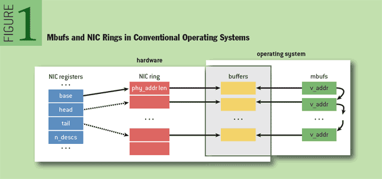
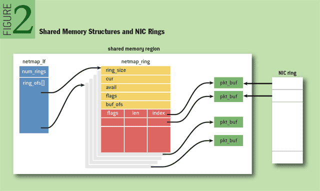
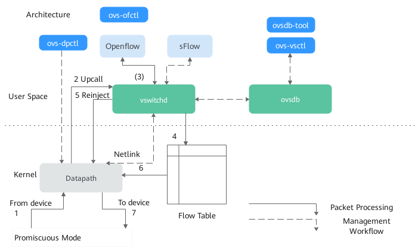
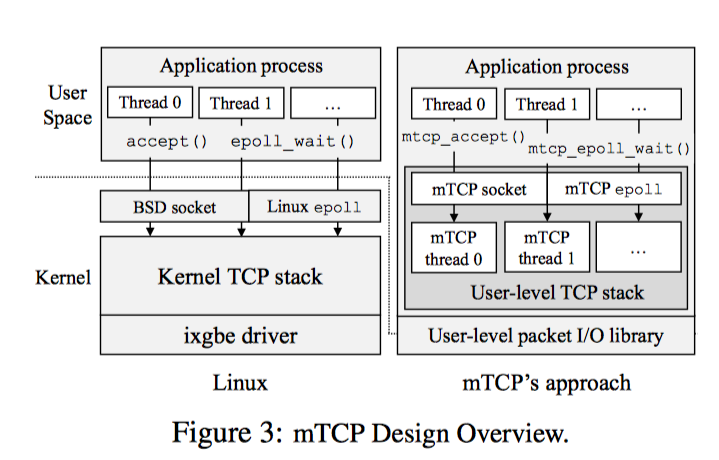
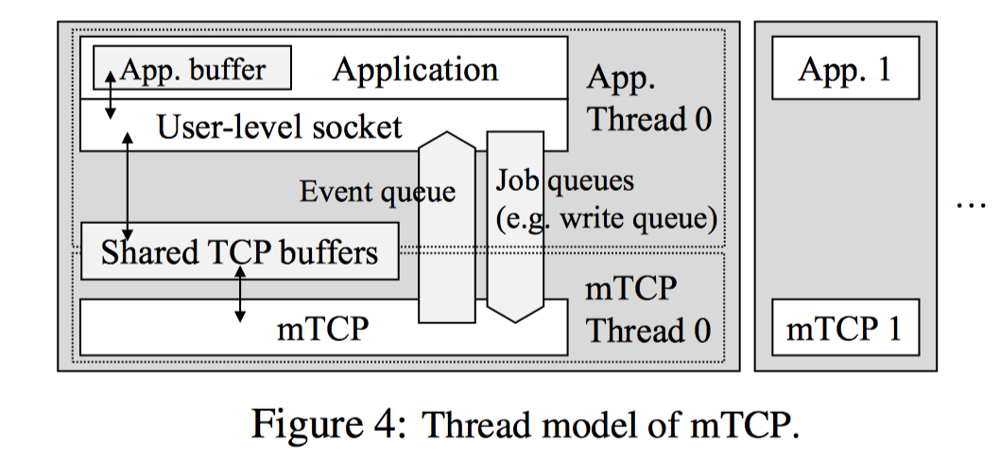
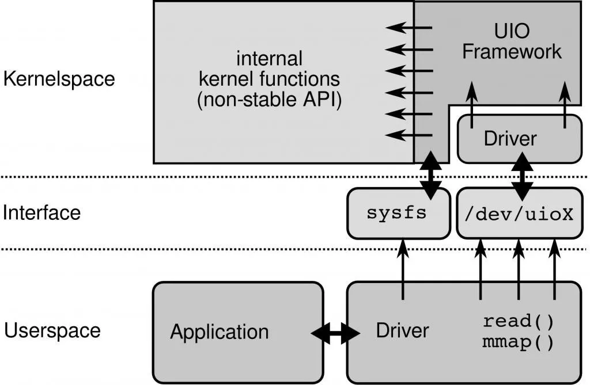

# 论用户态协议栈

## 1、 DPDK

### 1.1 DPDK介绍
Intel® DPDK 全称 Intel Data Plane Development Kit，是intel提供的数据平面开发工具集，为Intel architecture（IA）处理器架构下用户空间高效的数据包处理提供库函数和驱动的支持，它不同于Linux系统以通用性设计为目的，而是专注于网络应用中数据包的高性能处理。其工作在用户层，取代传统Linux系统中的网络数据报文处理。但需要注意的是，DPDK提供的是高性能处理报文的能力，而不是对报文的处理。这也提供了我们自定义用户协议栈的能力，通俗地说，就是一个用来进行包数据处理加速的软件库。

### 1.2 优势

1）轮询与中断
起初的纯轮询模式是指收发包完全不使用任何中断，集中所有运算资源用于报文处理。DPDK纯轮询模式是指收发包完全不使用中断处理的高吞吐率的方 式。DPDK所有的收发包有关的中断在物理端口初始化的时候都会关闭，也就是说，CPU这边在任何时候都不会收到收包或者发包成功的中断信号，也不需要任何收发包有关的中断处理。
2）多线程编程
DPDK通过在多核设备上创建多个线程，每个线程绑定到单独的核上，减少线程调度的开销，以提高性能。DPDK的线程可以作为控制线程，也可以作为数据线程。在DPDK 的一些示例中，控制线程一般绑定到MASTER核上，接受用户配置，并传递配置参数给数据线程等；数据线程分布在不同核上处理数据包。同时还需要考虑CPU特性和系统是否支持NUMA架构，如果支持的话，不同插槽上CPU的进程要避免访问远端内存，尽量访问本端内存。
3）CPU亲核性
当处理器进入多核架构后，自然会面对一个问题，按照什么策略将任务线程分配到各个处理器上执行。众所周知的是，这个分配工作一般由操作系统完成。负载均衡当然是比较理想的策略，按需指定的方式也是很自然的诉求，因为其具有确定性。简单地说，CPU亲和性（Core affinity）就是一个特定的任务要在某个给定的CPU上尽量长时间地运行而不被迁移到其他处理器上的倾向性。这意味着线程可以不在处理器之间频繁迁移。这种状态正是我们所希望的，因为线程迁移的频率小就意味着产生的负载小。将线程与CPU绑定，最直观的好处就是提高了CPU Cache的命中率，从而减少内存访问损耗，提高程序的速度。简单来说，通过CPU亲和性，绑定网卡和线程到固定的core，减少cpu任务切换。
4）大页表
默认下Linux采用4KB为一页，页越小内存越大，页表的开销越大，页表的内存占用也越大。CPU有TLB（Translation Lookaside Buffer）成本高所以一般就只能存放几百到上千个页表项。如果进程要使用64G内存，则64G/4KB=16000000（一千六百万）页，每页在页表项中占用16000000 * 4B=62MB。如果用HugePage采用2MB作为一页，只需64G/2MB=2000，数量不在同个级别。而DPDK采用HugePage，在x86-64下支持2MB、1GB的页大小，几何级的降低了页表项的大小，从而减少TLB-Miss。简单来说，通过大页内存，降低cache miss ，提高命中率，进而cpu访问速度。
5）无锁机制
实际上DPDK内部也有读写锁，LINUX系统本身也支持无锁操作，并且DPDK内部的无锁机制实现原理同LINUX系统提供的无锁机制的实现原理类似。两者都采用无锁环形队列的方式，采用环形队列的好处是，当一个数据元素被用掉后，其余数据元素不需要移动其存储位置，从而减少拷贝，提高效率。LINUX系统如果仅仅有一个读用户和一个写用户，那么不需要添加互斥保护机制就可以保证数据的正确性。但是，如果有多个读写用户访问环形缓冲区，那么必须添加互斥保护机制来确保多个用户互斥访问环形缓冲区。DPDK的无锁环形队列无论是单用户读写还是多用户读写都不需要使用互斥锁保护，所以，通过无锁队列，减少资源竞争。
6）cache预取
处理器从一级Cache读取数据需要3~5个时钟周期，二级是十几个时钟周期，三级是几十个时钟周期，而内存则需要几百个时钟周期。DPDK必须保证所有需要读取的数据都在Cache中，否则一旦出现Cache不命中，性能将会严重下降。为了保证这点，DPDK采用了多种技术来进行优化，预取只是其中的一种。
7）利用UIO技术
为了让驱动运行在用户态，Linux提供UIO机制。使用UIO可以通过read感知中断，通过mmap实现和网卡的通讯。
### 1.3数据包处理流程
1）Linux传统方式处理数据包流程
硬件中断—>取包分发至内核线程—>软件中断—>内核线程在协议栈中处理包—>处理完毕通知用户层
用户层收包–>网络层—>逻辑层—>业务层
2）DPDK处理数据包流程
硬件中断—>放弃中断流程
用户层通过设备映射取包—>进入用户层协议栈—>逻辑层—>业务层

DPDK与传统收发包方式对比

## 2、 NetMap

netmap 内存映射网卡的packet buffer到用户态，实现了自己的发送和接收报文的circular ring来对应网卡的 ring，使用 netmap 时，程序运行在用户态，即使出了问题也不会 crash 操作系统。

下图显示了一个接口可以有多个 netmap ring。

将文件描述符绑定到 NIC 时，应用程序可以选择将所有 ring或仅一个 ring附加到文件描述符。

使用所有 ring，相同的代码可以用于单队列或多队列 NIC。

使用一个 ring，可以通过每个 ring 一个进程/CPU core 来构建高性能系统，从而在系统中并行。

### NetMap VS DPDK

相同之处：将 NIC 的 rx_ring_buffer 和 tx_ring_buffer，映射到 user-level，直接在 user-level 进行 packet RX/TX。

不同之处：

- 使用netmap，需要很多手动操作的细节，比如说 手动修改 netmap_shadow_ring，不是很方便。
- rx_/tx_ring_buffer 都是由 netmap.ko 预分配，user-level application 不能动态分配，只能使用，而已。
- netmap 并不是在 user-level 实现 driver （__ DPDK 的 PMD 是在 user-level ）。
- netmap 只是将 ring_buffer 映射到user-level。
- netmap 也没有像 DPDK 那样规定 lcore thread model 和 进行packet RX/TX时的 multi-thread best practice。
- netmap 只是进行最简单的 packet RX/TX。

##  3、Open vSwitch

OVS（Open vSwitch）是一个基于Apache 2.0开源协议的多层软件交换机，致力于提供一个生产级质量的交换平台。OVS支持标准管理接口，并开放前向函数，以实现程序扩展和控制。

OVS软件主要的架构由内核态的Datapath和用户态的vswitchd、ovsdb组成。

Datapath是负责数据交换的内核模块，从网口读取数据，快速匹配FlowTable中的流表项，成功的直接转发，失败的上交vswitchd进程进行处理。在OVS初始化和port binding时注册钩子函数，把端口的报文处理接管到内核模块；

vswitchd是负责OVS管理和控制的守护进程，通过Unix Socket将配置信息保存到ovsdb中，并通过Netlink和内核模块进行交互；

ovsdb是OVS数据库，保存了OVS的配置信息。

##  4、 Multi-core TCP stack

mTCP的设计目标是在多核系统上实现高可扩展性，同时保持与现有多线程事件驱动应用程序的向后兼容性。

其中用到的思路要点如下：

1. 不修改kernel，只修改用户空间库。

2. 为每个核维护自己的数据结构，包括tcb、socket的buffer以及相应队列，从而避免竞争锁问题，并增加缓存性能

3. 为了保证多网卡下的高效处理，mTCP采用PacketShader I / O引擎（PSIO）来提供高效率的事件驱动的数据包I / O接口，提供了ps_select。

4. 避免频繁用户/内核切换的开销，mTCP采用一个名为零线程的TCP来提供功能，以用户态的模式来进行交互。

5. 高效的TCP timer管理，并进行优先级管理，对小封包连接进行优化，保证性能

6. 批处理网络报文，使用batch，来平摊额外开销。

简单来讲，mTCP分别为每个应用线程创建一个TCP线程，并将该线程绑定到一个物理CPU核上，从而避免了不同核、不同线程互相的竞争与干扰。与此同时，mTCP通过将系统调用转换为内部进程间通信来避免高昂的用户/内核切换开销，从而提高整个TCP协议栈的性能。

 

如上所示，Application使用mTCP库函数通过共享缓存与mTCP线程通信。共享缓存的唯一访问入口就是库函数，这样可以保证内部TCP数据的共享安全性。当库函数需要修改共享数据时，只需要简单的将请求放到job queue。来自于不同流的多个请求在一个循环内被堆积在jobqueue中，当mTCP获得CPU后，便对这些请求进行批处理。来自于mTCP线程的flow events会被放入event queue，处理方式同job queue。

## 5、 UIO介绍

### 5.1 什么是UIO

​		UIO，即Userspace I/O内核驱动，它在Linux kernel的世界比较小众，主要服务于一些定制设备。**UIO**负责将中断和设备内存暴露给用户空间，然后再由**UIO**用户态驱动实现具体的业务。另外Linux系统中一般的驱动设备都是运行在内核空间，而在用户空间用应用程序调用即可，而UIO则是将驱动的很少一部分运行在内核空间，而在用户空间实现驱动的绝大多数功能！使用UIO可以避免设备的驱动程序需要随着内核的更新而更新的问题。

### 5.2 为什么用UIO

​		硬件设备可以按照不同维度进行分类，比如从功能维度而言，可分为网络设备、块设备等。现实中还存在一些设备无法划分到里头，比如I/O卡或定制的FPGA，而这些设备驱动主要是以字符驱动方式进行开发，**必须编写一个完整的内核驱动，而且还得一直维护这些代码**。如果把这种设备的驱动放入Linux内核中，**不但增大了内核的负担，也没人愿意花费大量精力去维护。**

​		假如采取UIO驱动方式，则将简单很多。我们不仅可以利用所有用户空间的应用程序开发工具和库，而且**当内核发生变化时，只需更改UIO框架与内核程序交互的接口即可**，不需要更改UIO框架的驱动。除此之外，UIO可以使用**C++、Java等高级语言进行开发**（内核驱动仅能使用C语言和汇编代码），而且我们还能够参考内核驱动已实现的代码，极大提高我们的开发效率。最后还有一个优势就是，调测用户态程序比内核态程序简单得多，**即便用户空间驱动程序挂了，也不会影响系统的正常运行。**

### 5.3 UIO工作原理

​		设备驱动主要完成2件事：**处理设备产生的硬中断和存取设备内存**。硬中断处理必须在内核空间进行，而设备内存的存取可以在用户空间进行。

​		UIO框架分为2部分，**内核空间驱动和用户空间驱动**，内核部分主要实现硬件寄存器的内存映射及读写操作，而用户空间部分负责将UIO设备的uio_mem映射到本地，实现用户空间程序能够访问硬件设备寄存器。UIO驱动模型请参考图1所示。

​																								图1 Linux UIO驱动模型图

**1、UIO内核部分**

​         UIO内核驱动*做的事情相对来说比较少，*主要的任务是分配和记录设备所需的资源*（使能PCI设备、申请资源、读取并记录配置信息）、*注册UIO设备*（uio_register_device()）*以及实现硬中断处理函数。

**2、UIO用户空间部分**

​		*用户空间驱动*主要完成2个关键任务，*响应硬件中断和从存取设备内存。*

​		响应硬中断通常有2种处理方式，1）调用read()，阻塞/dev/uioX，当设备产生中断时，read()操作立即返回；2）调用poll()，使用select()等待中断发生（select()有一个超时参数可用来实现有限时间内等待中断）。

### 5.4 UIO应用

####  5.4.1 **数据面（虚拟交换机）**

------

**OVS**

Open vSwitch 是一个多核虚拟交换机平台，支持标准的管理接口和开放可扩展的可编程接口，支持第三方的控制接入。

https://github.com/openvswitch/ovs

**VPP**

VPP 是 cisco 开源的一个高性能的包处理框架，提供了 交换/路由 功能，在虚拟化环境中，使它可以当做一个虚拟交换机来使用。在一个类 SDN 的处理框架中，它往往充当数据面的角色。经研究表明，VPP 性能要好于 OVS+DPDK 的组合，但它更适用于 NFV，适合做特定功能的网络模块。

https://wiki.fd.io/view/VPP

**Lagopus**

Lagopus 是另一个多核虚拟交换的实现，功能和 OVS 差不多，支持多种网络协议，如 Ethernet，VLAN，QinQ，MAC-in-MAC，MPLS 和 PBB，以及隧道协议，如 GRE，VxLan 和 GTP。

https://github.com/lagopus/lagopus/blob/master/QUICKSTART.md

**Snabb**

Snabb 是一个简单且快速的数据包处理工具箱。

https://github.com/SnabbCo/snabbswitch/blob/master/README.md

#### 5.4.2 **数据面（虚拟路由器）**

------

**OPENCONTRAIL**

一个集成了 SDN 控制器的虚拟路由器，现在多用在 OpenStack 中，结合 Neutron 为 OpenStack 提供一站式的网络支持。

http://www.opencontrail.org/

**CloudRouter**

一个分布式的路由器。

https://cloudrouter.org/

#### 5.4.3 **用户空间协议栈**

------

**mTCP**

mTCP 是一个针对多核系统的高可扩展性的用户空间 TCP/IP 协议栈。

https://github.com/eunyoung14/mtcp/blob/master/README

**IwIP**

IwIP 针对 RAM 平台的精简版的 TCP/IP 协议栈实现。

http://git.savannah.gnu.org/cgit/lwip.git/tree/README

**Seastar**

Seastar 是一个开源的，基于 C++ 11/14 feature，支持高并发和低延迟的异步编程高性能库。

http://www.seastar-project.org/

**f-stack**

腾讯开源的用户空间协议栈，移植于 FreeBSD协议栈，粘合了 POSIX API，上层应用（协程框架，Nginx,Redis），纯 C 编写，易上手。

https://github.com/f-stack/f-stack

#### 5.4.4 **存储加速**

------

**SPDK**

SPDK 是 DPDK 的孪生兄弟，专注存储性能加速，目前的火热程度丝毫不亚于 DPDK，Intel 近来对 SPDK 特别重视，隔三差五就发布新版本。

https://github.com/spdk/spdk
