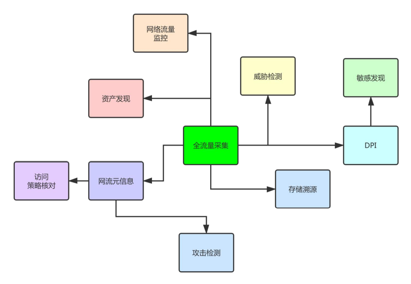
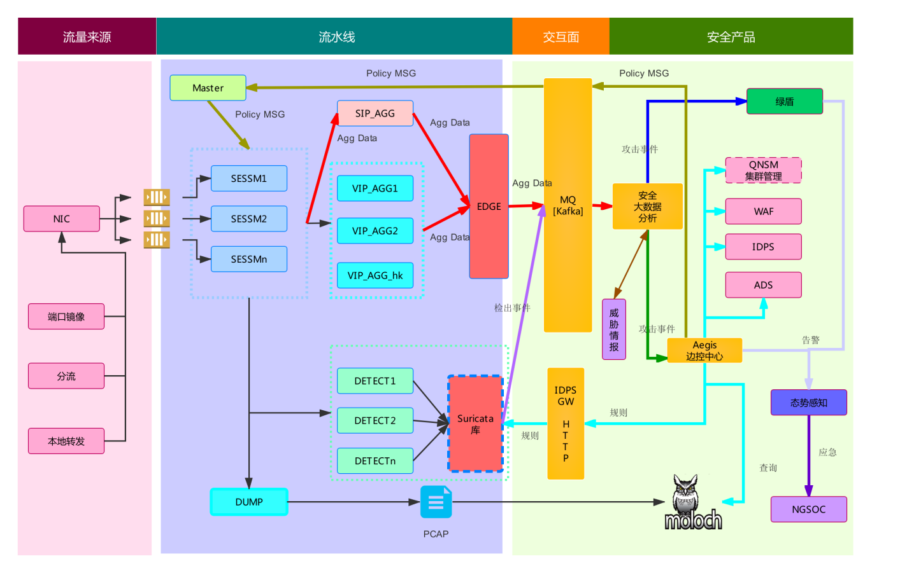
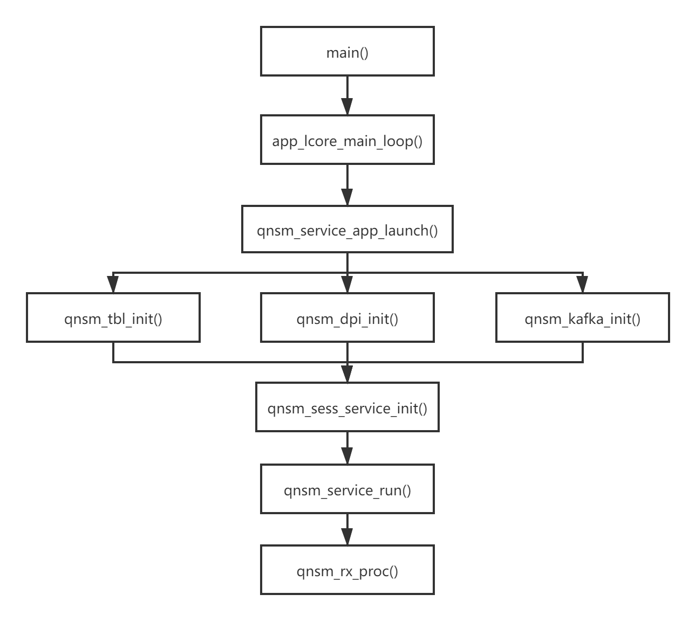
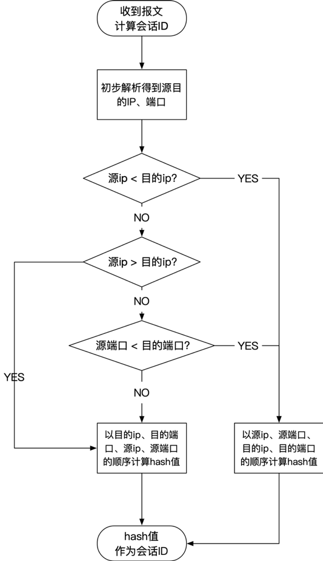

# QNSM研发手册

> **date**: 2021.06.15
>
> **auther**: Mikewyf
>
> **tag**: `QNSM`

## QNSM简介

**QNSM(IQIYI Network Security Monitor) 是一个旁路部署的全流量，实时，高性能网络安全监控引擎，基于DPDK开发，集成了DDOS检测和 IDPS模块。**

目前QNSM已经应用到爱奇艺包括DDOS攻击检测、IDPS、网络DLP等多种安全检测场景，累计部署22+集群共计130+分析节点，总分析带宽容量达到1TBps。

**全流量采集对网络运维和安全运维意义重大**

- 资产发现
- 网络流量监控、可视化、AIOps
- 异常预警、威胁和攻击检测
- 内容提取、敏感发现、泄露检测
- 行为和流量基线建模和ACL策略核对
- 精细分析：机器学习、专家人工分析
- 取证溯源、事件回查重放

## QNSM系统架构

- 基础库

  **PORT: 对网卡队列和cpu核之间ring队列的逻辑封装**

  **MSG: 封装了支持回调的CPU核心之间的传递的通信消息（包括策略消息、数据消息）**

  ACL: 支持回调的基于五元组的策略描述

  **TBL: 对DPDK中rte_hash表的封装，提供CRUD操作接口，实现基于mempool的表项资源分配**

  SCHED: 工作线程封装，支持自定义包处理、策略执行、消息分发和定时回调等

- 流水线组件

  **SESSM: IPv4和IPv6数据包解析，FLOW数据聚合，TCP连接跟踪，应用层DPI/DFI。**

  SIP_AGG: 基于攻击源IP特征聚合和输出到EDGE

  VIP_AGG: 基于目标VIP特征聚合和输出到EDGE

  DUMP: 保存为pcap文件供事件回溯和专家分析

  **EDGE: 输出多维数据至Kafka**

  DETECT: 基于Suricata支持 IDPS检测

- 控制面和工具

  主要包括Master组件以及相关配置文件。

  Master负责接收分析中心的攻击事件策略并下发至相应的转发面组件，包含dump数据包，攻击源，攻击源端口，反射攻击proto DFI。

## QNSM部署方式

上图展示了在爱奇艺如何应用QNSM来满足各种安全需求，爱奇艺的QNSM服务节点分布在各个网络分区的边界上，并通过边控中心来进行管理和维护。我们对QNSM的应用方式与爱奇艺相似，但目前只用到了SESSM、EDGE两个组件，中间的SIP_AGG、VIP_AGG以及提供检测功能的DETECT组件都尚未用到。

## QNSM安装与配置

[QNSM安装教程](./QNSM_install.md)

[QNSM配置](./QNSM_configure.md)

## QNSM执行流程

### 初始化

qnsm程序入口位于./src/qnsm_inspect_main.c，在main()函数中主要进行相关配置的读取解析，程序运行环境的初始化，相关数据结构的初始化（用于会话管理的tbl的预初始化在这个位置，结构体tbl是qnsm中对rte_hash的封装）等，然后在每个lcore上调用./src/runtime.c中的app_lcore_main_loop()函数，即每个lcore上都执行一次app_lcore_main_loop()函数，但每个lcore的具体执行内容需要根据配置文件中为该lcore分配的组件决定。该函数会注册各个功能组件的初始化函数，其中与我们功能相关的是**qnsm_sess_service_init()**，qnsm中协议解析、会话管理以及dpi功能都位于SESSM这个组件中，需要重点关注。然后调用src/qnsm_service.c中的qnsm_service_app_launch()函数执行当前组件的初始化。

在初始化过程中，与我们相关的通用过程是qnsm_tbl_init()（初始化会话表）、qnsm_dpi_init()（应用协议解析）和qnsm_kafka_init()（kafka输出），这里的通用初始化是指无论当前lcore运行的是qnsm中的哪个组件，都会执行这些初始化过程，可以用参数配置的方式关闭其中一些不需要的初始化过程。在执行完通用初始化之后，会执行当前组件的初始化，需要关注的是前面提到过的位于src/qnsm_session.c的qnsm_sess_service_init()函数，在该函数中会对sess组件用到的会话管理tbl，tcp连接数据暂存的cache，以及dpi回调函数进行初始化或配置。需要重点关注的函数为qnsm_sess_tbl_reg()（会话管理）、tcp_lcore_init()（tcp连接管理）和http_init()、dns_init()等具体应用层协议的初始化函数。

初始化过程结束后，调用src/qnsm_service.c中的qnsm_service_run()函数进入组件核心功能部分，SESSM组件的核心功能位于qnsm_session.c中的**qnsm_rx_proc()**函数，后续数据包的解析，会话管理以及应用层数据的解析都会在这个函数内执行。

### 会话统计与管理

会话统计与管理部分的代码位于./src/qnsm_session.c文件，使用DPDK接收到的流量为二层MAC帧，因此对流量的处理需要从各层协议的解析开始。在qnsm_rx_proc()中，首先会对数据包进行简单的解析（调用DPDK的rte_net_get_ptype()），这部分会解析至网络层，同时识别到传输层所用协议，解析得到的信息被存在QNSM_PACKET_INFO结构体中，数据包的相关信息，例如五元组，长度，传输层协议等，都会被填入该结构体。然后再根据识别到的传输层协议决定是否进行会话统计与管理，目前qnsm会对TCP、UDP和ICMP三种协议进行会话统计与管理。

当识别到上述三种协议之后，会调用**qnsm_sess_proc()**进行会话管理，qnsm中所有正在进行的会话信息都会被暂存到QNSM_TBL中，其中每一项就表示一个会话。qnsm会根据每个会话的五元组信息设置会话在tbl中存储的key(会话ID)，计算方法如下：

当前管理的所有会话数目由QNSM_TBL中的item_num表示。会话自身的统计信息存在QNSM_SESS结构体中，其中一些关键的会话统计信息，例如会话包数、bit数等，存放在QNSM_SESS的QNSM_FLOW_STATISTICS中。qnsm使用定时器rte_timer来管理会话的生存周期，在创建新会话的同时初始化定时器，每次收到该会话新报文是重置定时器，定时器结束时输出会话信息并释放存储空间，此外TCP连接的正常终止也会立即停止会话，会话终止处理函数为qnsm_sess_aging()。

TCP/UDP协议都会通过会话管理过程，其中UDP的处理相对简单，直接通过端口匹配对应的应用层协议并完成解析即可；而TCP协议的处理需要自行管理双方向报文的seq号、ack号，并缓存部分报文以保证所有报文有序排列。TCP协议的处理位于**tcp_conn_proc()**中。

