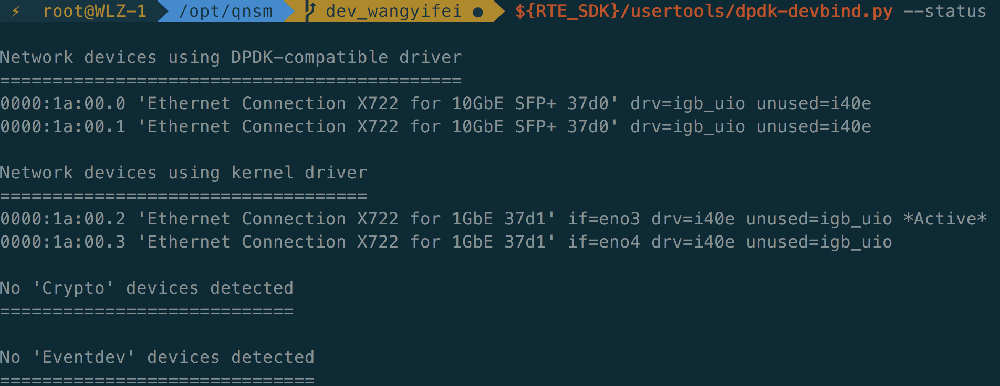

# **qnsm安装文档**

## **部署环境**

操作系统：CentOS Linux release 7.5.1804 (Core)

内核版本：3.10.0-862.el7.x86_64

网卡型号：Intel Corporation Ethernet Connection X722 for 10GbE SFP+

网卡驱动版本：5.4.0-k （输入modinfo igb命令查看）

dpdk版本：dpdk-stable-16.11.2

## **依赖安装**

CentOS：

```
$ yum install -y libpcap-devel pcre-devel file-devel libyaml-devel jansson-devel libcap-ng-devel librdkafka-devel nss-devel nspr-devel make gcc
$ yum install -y libxml2-devel
$ yum install -y python-pip
$ pip install configparser
```

安装python-pip时可能需要先安装epel源 *yum -y install epel-release*

## **DPDK 环境准备**

QNSM没有对dpdk版本有特殊要求，官方文档使用的稳定版本是dpdk-stable-16.11.2（未来支持新功能可能需要使用更新版本）。

```
$ mkdir -p /opt/qnsm_deps/
$ cd /opt/qnsm_deps/
$ wget https://fast.dpdk.org/rel/dpdk-16.11.2.tar.xz   
$ tar vxf dpdk-16.11.2.tar.xz
```

### **DPDK 编译安装**

```
$ cd dpdk-stable-16.11.2
$ export RTE_SDK=`pwd`
$ export RTE_TARGET=x86_64-native-linuxapp-gcc
$ make install T=${RTE_TARGET} DESTDIR=install
```

编译dpdk-stable-16.11.2时，可能会报"提供给函数‘ndo_dflt_bridge_getlink’的实参太少”错误，可参考https://blog.csdn.net/li727507857/article/details/102564302/解决。

## **编译**

### **下载代码**

```
$ cd /opt
$ git clone https://github.com/iqiyi/qnsm.git
$ cd qnsm
```

### **运行环境**

修改配置文件conf/dpdk_env.cfg，我们这里使用eno1和eno2两张网卡。

```
[NIC1]
name=eno1
[NIC2]
name=eno2
```

运行环境配置脚本。

```
$ python ./scripts/setup_dpdk_env.py conf/dpdk_env.cfg
$ ${RTE_SDK}/tools/dpdk-devbind.py --status
Network devices using DPDK-compatible driver
============================================
0000:06:00.0 '82599ES 10-Gigabit SFI/SFP+ Network Connection' drv=igb_uio unused=
0000:06:00.1 '82599ES 10-Gigabit SFI/SFP+ Network Connection' drv=igb_uio unused=
$ cat /proc/meminfo | grep Huge
AnonHugePages:   9955328 
kBHugePages_Total:   '11264'
HugePages_Free:        0
HugePages_Rsvd:        0
HugePages_Surp:        0
Hugepagesize:      '2048 kB'
```

下图状态为绑定成功的情况：                 

        

### **编译安装IDPS lib**

运行build_idps.sh脚本，该脚本会安装patch/suricata-4.1.0/0001-IDPS-make-as-a-lib-support-kafka.patch补丁并编译为lib。这里需要注意，qnsm中的build_idps.sh貌似有bug，在执行第25行git clone $SURICATA_URL $DEP_PATH时会报错，因此需要将第25行修改为

```
git clone $SURICATA_URL $DEP_PATH/suricata
```

修改之后脚本可正常执行(mxparser代码库中已修改)，正常流程如下

```
$ cd scripts
$ sh build_idps.sh
$ ls /usr/local/lib | egrep 'suri|htp'
libhtp.a  libhtp.la  libhtp.so  libhtp.so.2  libhtp.so.2.0.0  libsuri.a  libsuri.la  libsuri.so  libsuri.so.0  libsuri.so.0.0.0 
$ ls /usr/local/include/ | egrep 'suri|htp'
htp  suricata
```

### **编译QNSM**

运行build_qnsm_lib.sh脚本编译QNSM基础库。

```
$ sh build_qnsm_lib.sh
$ ll $RTE_SDK/$RTE_TARGET/lib/libqnsm_service.a
```

支持编译成debug或者release版本，默认release版本。debug版本提供一些调试命令用于展示运行时数据。如果需要编译debug版本，执行以下命令。

```
$ cat ../config
CONFIG_QNSM_LIBQNSM_IDPS=y
CONFIG_DEBUG_QNSM=n
$ sed -i '/CONFIG_DEBUG_QNSM/s/=n/=y/g' ../config
```

编译qnsm主程序。

```
$ cd ..
$ make
$ make install
$ ls /var/qnsm
suricata.yaml  qnsm_edge.xml  qnsm-inspect  qnsm_inspect.cfg qnsm_sessm.xml  qnsm-test  qnsm_vip.xml
```

ddos、idps、ddos-idps是qnsm支持的三种部署形态，默认以ddos-idps形态安装配置文件；如果以idps形态部署，make install T=idps。